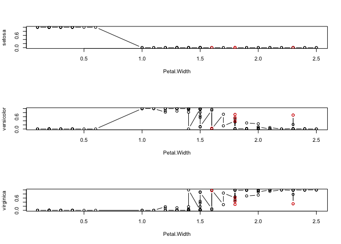

Part 3: Data Mart
================

# Table of Contents

  - **Chapter 1 - 데이터 변경 및 요약 (Data Change and Summary)**
      - R reshape를 이용한 데이터 마트 개발
      - sqldf를 이용한 데이터 분석
      - plyr을 이용한 데이터 분석
      - 데이터 테이블
  - **Chapter 2 - 데이터 가공 (Data Processing)**
      - Data Exploration
      - 변수 중요도
      - 변수의 구간화
  - **Chapter 3 - 기초 분석 및 데이터 관리 (Basic Analysis and Data Management)**
      - 데이터 EDA(탐색적 자료 분석)
      - 결측값 인식
      - 결측값 처리 방법
      - R에서 결측값 처리
      - 이상값(Outlier) 인식과 처리

# Chapter 1 - 데이터 변경 및 요약 (Data Change and Summary)

## 1\. R reshape를 이용한 데이터 마트 개발

#### 가. 데이터 마트

  - **데이터 웨어하우스** 와 **사용자 사이의 중간층에 위치** 한 것으로, 하나의 주제 또는 하나의 부서 중심의 데이터
    웨어하우스라고 할 수 있다
  - 데이터 마트 내 대부분의 데이터는 데이터 웨어하우스로부터 복제되지만, 자체적으로 수집될 수도 있으며, 관계형 데이터
    베이스나 다차원 데이터 베이스를 이용하여 구축 한다
  - CRM(Customer Relationship Management) 관련 업무 중에서 핵심 - 고객 데이터 마트 구축
  - 동일한 데이터 셋을 활용할 경우, 최신 분석기법들을 이용하면 분석가의 역량에서는 분석 효과가 크게 차이가 나지 않기 떄문에
    데이터 마트를 어떻게 구축하느냐에 따라 분석 효과는 크게 차이 난다

최상위

  - **전산소:**                          DBA      DBA      DBA      DBA
         DBA
  - **운영 데이터:**                          RDB            RDB
              외부DB
  - **데이터 변환:**                        접속    발췌    필터링    요약    정렬
  - **데이터 웨어하우스:**                                    RDB
  - **복사 및 보급:**
  - **데이터 마트:**                        지역    고객    마케팅    재무    협력사
  - **데이터 마이닝:**           통계분석 클러스터링 신경망 규칙추론 의사결정트리
  - **데이터 액세스 툴:** 다차원분석 데이터시각화 EIS/DSS 스프레드시트 응용개발툴
  - **최종 사용자:**     파워유저     분석가              임원             고객상담자
        응용서버

최하위

#### 나. 요약변수

  - 수집된 정보를 **분석에 맞게 종합한 변수** 이다
  - 데이터마트에서 가장 기본적인 변수로 **총구매 금액, 금액, 횟수, 구매여부 등 데이터 분석을 위해 만들어 지는 변수**
    이다
  - 많은 모델을 공통으로 사용될 수 있어 **재활용성이 높다**
  - 합계, 횟수와 같이 간단한 구조이므로 자동화하여 상황에 맞게 또는 일반적인 자동화프로그램으로 구축 가능하다
  - 요약변수의 단점은 얼마 이상이면 구매하더라도 기준값의 의미 해석이 애매할 수 있다. 이러한 경우, 연속형 변수를 그룹핑해
    사용하는 것이 좋다
  - <예시>
  - **기간별 구매 금액, 횟수 여부**
      - 고객의 구매 패턴을 볼 수 있는 변수이다
  - **위클리 쇼퍼**
      - 구매 시기를 통해 고객의 특성을 추정하는데 활용 가능하다
  - **상품별 구매 금액, 회수 여부**
      - 고객의 라이프 스테이지와 라이프 스타일 등을 이해하는데 크게 도움이 된다
  - **상품별 구매 순서**
      - 고객에 대한 이해와 해석력을 높일 수 있다
  - **유통 채널별 구매 금액**
      - 온라인과 오프라인 사용 고객에게 모두 사용하도록 유도하는데 활용한다
  - **단어 빈도**
      - 텍스트 자료에서 단어들의 출현 빈도를 데이터화하여 사용한다
  - **초기 행동변수**
      - 고객 가입 또는 첫 거래 초기 1개월 간 거래 패턴에 대한 변수로 1년후에 어떤 행동을 보일지를 평가하는 지표로
        활용한다
  - **트렌드 변수**
      - 추이(상황변화)값을 나타내는 변수이다
  - **결측값과 이상값 처리**
      - 결측값과 이상값은 무리해서 처리하려고 하면 시간과 위험이 커질 수 있으므로 데이터의 내용을 파악하여 처리해야 한다
  - **연속형 변수의 구간화**
      - 분석후 적용 단계를 고려한 데이터 분석을 위해 연령이나 비용 등 연속형 변수를 구간화 하는 것이 필요하다. 반드시
        10, 100, 1000 단위로 구간화하지 말고 의미있는 구간으로 구간화한다

#### 다. 파생변수

  - 사용자(분석가)가 **특정 조건을 만족** 하거나 **특정 함수에 의해 값을 만들어 의미를 부여한 변수** 이다
  - 매우 **주관적일 수 있으므로 논리적 타당성을 갖추어 개발** 해야 한다
  - **세분화, 고객 행동 예측, 캠페인 반응 예측** 에 매우 잘 활용된다
  - 파생변수는 상황에 따라 특정 상황에만 유의미하지 않게 대표성을 나타나게 할 필요가 있다
  - <예시>
  - **근무시간 구매지수**
      - 근무시간대에 거래가 발생하는 비율을 산출하여 활용
  - **주 구매 매장 변수**
      - 고객의 주거래 매장을 예측하여 적절한 분석에 활용
  - **주 활동 지역 변수**
      - 고객의 정보나 거래내용을 통해 주 활동지역을 예측하여 분석에 활용
  - **주 구매상품 변수**
      - 상품을 추천하는데 활용
      - (1순위 상품을 구매하고 2순위 상품을 구매하지 않은 고객에게 추천)
  - **구매상품 다양성 변수**
      - 고객이 다양한 상품이나 같은 브랜드 등을 구매하는 성향을 파악하여 분석에 필요한 변수로 변환
  - **선호하는 가격대 변수**
      - 각자의 취향, 소득, 서비스 등에 따라 많이 투자하는 상품군이 있는데 주로 패션 분야에 중요하게 적용
  - **시즌 선호고객 변수**
      - 각자 의미 있게 생각하는 날 소비가 많이 이루어지기 때문에 패턴을 파악하여 분석에 활용(주로 유통업)
  - **라이프 스테이지 변수**
      - 고객이 속한 라이프 스테이지를 예측하여 행동을 이해하고 그들의 니즈와 가치를 파악하는데 활용
  - **라이프스타일 변수**
      - 고객의 라이프스타일을 보고 상품구매를 유도하는데 활용
  - **행사민감 변수**
      - 같은 상품도 행사를 할 때 구매하는 사람이 있고 행사와 관련 없이 구매하는 사람이 있는데 이런 행동 패턴을 파악하여
        활용
  - **휴면가망 변수**
      - 고객은 늘 구매하지 않기 떄문에 고객의 취향이나 관심사가 변해 구매하지 않거나 경쟁사의 상품을 선호하게 되는 경우가
        있는데 이를 파악하여 사전 대응에 활용
  - **최대가치 변수**
      - 고객의 가치를 판단하여 어느 정도를 판매할 수 있는지를 예측하는데 활용
  - **최적 통화 시간**
      - 콜센터에 걸려온 시간으로 고객의 직업 등을 고려한 통화시간을 예측하여 통화를 시도

#### 라. reshape의 활용

``` r
# install.packages("reshape")
# packageVersion("reshape")
library(reshape)
```

  - reshape 패키지에는 **melt()와 cast()** 라는 2개의 핵심 함수가 있다 (철을 녹이고 다시 틀에 넣어
    모양을 만드는 과정에 비유하여, **녹이는 함수를 melt(), 모양을 만드는 함수를 cast()** 로 사용한다)
  - **melt():** 원데이터 형태로 만드는 함수
  - **cast():** 요약 형태로 만드는 함수
  - 다음의 예시는 reshape 패키지의 주요 기능인 melt를 이용해 airquality 데이터의 Month, id를
    기준으로 모든 데이터를 표준형식으로 변환한다
  - 변수를 조합해 변수명을 만들고 변수들을 시간, 상품 등의 차원에 결합해 다양한 요약변수와 파생변수를 쉽게 생성하여
    데이터마트를 구성할 수 있게 한다

<!-- end list -->

``` r
str(airquality)
```

    ## 'data.frame':    153 obs. of  6 variables:
    ##  $ Ozone  : int  41 36 12 18 NA 28 23 19 8 NA ...
    ##  $ Solar.R: int  190 118 149 313 NA NA 299 99 19 194 ...
    ##  $ Wind   : num  7.4 8 12.6 11.5 14.3 14.9 8.6 13.8 20.1 8.6 ...
    ##  $ Temp   : int  67 72 74 62 56 66 65 59 61 69 ...
    ##  $ Month  : int  5 5 5 5 5 5 5 5 5 5 ...
    ##  $ Day    : int  1 2 3 4 5 6 7 8 9 10 ...

``` r
head(airquality)
```

    ##   Ozone Solar.R Wind Temp Month Day
    ## 1    41     190  7.4   67     5   1
    ## 2    36     118  8.0   72     5   2
    ## 3    12     149 12.6   74     5   3
    ## 4    18     313 11.5   62     5   4
    ## 5    NA      NA 14.3   56     5   5
    ## 6    28      NA 14.9   66     5   6

``` r
summary(airquality)
```

    ##      Ozone           Solar.R           Wind             Temp      
    ##  Min.   :  1.00   Min.   :  7.0   Min.   : 1.700   Min.   :56.00  
    ##  1st Qu.: 18.00   1st Qu.:115.8   1st Qu.: 7.400   1st Qu.:72.00  
    ##  Median : 31.50   Median :205.0   Median : 9.700   Median :79.00  
    ##  Mean   : 42.13   Mean   :185.9   Mean   : 9.958   Mean   :77.88  
    ##  3rd Qu.: 63.25   3rd Qu.:258.8   3rd Qu.:11.500   3rd Qu.:85.00  
    ##  Max.   :168.00   Max.   :334.0   Max.   :20.700   Max.   :97.00  
    ##  NA's   :37       NA's   :7                                       
    ##      Month            Day      
    ##  Min.   :5.000   Min.   : 1.0  
    ##  1st Qu.:6.000   1st Qu.: 8.0  
    ##  Median :7.000   Median :16.0  
    ##  Mean   :6.993   Mean   :15.8  
    ##  3rd Qu.:8.000   3rd Qu.:23.0  
    ##  Max.   :9.000   Max.   :31.0  
    ## 

  - **melt() 함수**
      - Melt an object into a form suitable for easy casting

<!-- end list -->

``` r
str(melt)
```

    ## function (data, ...)

``` r
m <- melt(airquality, id = c("Month", "Day"), na.rm = T)
head(m)
```

    ##   Month Day variable value
    ## 1     5   1    Ozone    41
    ## 2     5   2    Ozone    36
    ## 3     5   3    Ozone    12
    ## 4     5   4    Ozone    18
    ## 5     5   6    Ozone    28
    ## 6     5   7    Ozone    23

  - **cast() 함수**
      - Cast a molten data frame into the reshaped or aggregarted form
        you want

<!-- end list -->

``` r
str(cast)
```

    ## function (data, formula = ... ~ variable, fun.aggregate = NULL, ..., margins = FALSE, 
    ##     subset = TRUE, df = FALSE, fill = NULL, add.missing = FALSE, value = guess_value(data))

``` r
head(cast(m, Day ~ Month ~ variable))
```

    ## , , variable = Ozone
    ## 
    ##    Month
    ## Day  5  6   7  8  9
    ##   1 41 NA 135 39 96
    ##   2 36 NA  49  9 78
    ##   3 12 NA  32 16 73
    ##   4 18 NA  NA 78 91
    ##   5 NA NA  64 35 47
    ##   6 28 NA  40 66 32
    ## 
    ## , , variable = Solar.R
    ## 
    ##    Month
    ## Day   5   6   7  8   9
    ##   1 190 286 269 83 167
    ##   2 118 287 248 24 197
    ##   3 149 242 236 77 183
    ##   4 313 186 101 NA 189
    ##   5  NA 220 175 NA  95
    ##   6  NA 264 314 NA  92
    ## 
    ## , , variable = Wind
    ## 
    ##    Month
    ## Day    5    6    7    8    9
    ##   1  7.4  8.6  4.1  6.9  6.9
    ##   2  8.0  9.7  9.2 13.8  5.1
    ##   3 12.6 16.1  9.2  7.4  2.8
    ##   4 11.5  9.2 10.9  6.9  4.6
    ##   5 14.3  8.6  4.6  7.4  7.4
    ##   6 14.9 14.3 10.9  4.6 15.5
    ## 
    ## , , variable = Temp
    ## 
    ##    Month
    ## Day  5  6  7  8  9
    ##   1 67 78 84 81 91
    ##   2 72 74 85 81 92
    ##   3 74 67 81 82 93
    ##   4 62 84 84 86 93
    ##   5 56 85 83 85 87
    ##   6 66 79 83 87 84

With aggregation

``` r
cast(m, Month ~ variable, mean)
```

    ##   Month    Ozone  Solar.R      Wind     Temp
    ## 1     5 23.61538 181.2963 11.622581 65.54839
    ## 2     6 29.44444 190.1667 10.266667 79.10000
    ## 3     7 59.11538 216.4839  8.941935 83.90323
    ## 4     8 59.96154 171.8571  8.793548 83.96774
    ## 5     9 31.44828 167.4333 10.180000 76.90000

``` r
head(cast(m, Day ~ variable, mean))
```

    ##   Day    Ozone  Solar.R  Wind Temp
    ## 1   1 77.75000 199.0000  6.78 80.2
    ## 2   2 43.00000 174.8000  9.16 80.8
    ## 3   3 33.25000 177.4000  9.62 79.4
    ## 4   4 62.33333 197.2500  8.62 81.8
    ## 5   5 48.66667 163.3333  8.46 79.2
    ## 6   6 41.50000 223.3333 12.04 79.8

``` r
b <- cast(m, Month ~ Day, mean)
b[, 1:9]
```

    ##   Month       1        2        3         4         5         6       7       8
    ## 1     5  76.350  58.5000  61.9000 101.12500  35.15000  36.30000  98.900  47.700
    ## 2     6 124.200 123.5667 108.3667  93.06667 104.53333 119.10000  61.925 122.300
    ## 3     7 123.025  97.8000  89.5500  65.30000  81.65000 111.97500 111.525 115.575
    ## 4     8  52.475  31.9500  45.6000  56.96667  42.46667  52.53333 117.500 104.575
    ## 5     9  90.225  93.0250  87.9500  94.40000  59.10000  55.87500  90.725  82.825

Without aggregation

``` r
head(cast(m, Month + Day ~ variable))
```

    ##   Month Day Ozone Solar.R Wind Temp
    ## 1     5   1    41     190  7.4   67
    ## 2     5   2    36     118  8.0   72
    ## 3     5   3    12     149 12.6   74
    ## 4     5   4    18     313 11.5   62
    ## 5     5   5    NA      NA 14.3   56
    ## 6     5   6    28      NA 14.9   66

``` r
a <- cast(m, Month + variable ~ Day)
a[ , 1:10]
```

    ##    Month variable     1     2     3     4     5     6     7     8
    ## 1      5    Ozone  41.0  36.0  12.0  18.0    NA  28.0  23.0  19.0
    ## 2      5  Solar.R 190.0 118.0 149.0 313.0    NA    NA 299.0  99.0
    ## 3      5     Wind   7.4   8.0  12.6  11.5  14.3  14.9   8.6  13.8
    ## 4      5     Temp  67.0  72.0  74.0  62.0  56.0  66.0  65.0  59.0
    ## 5      6    Ozone    NA    NA    NA    NA    NA    NA  29.0    NA
    ## 6      6  Solar.R 286.0 287.0 242.0 186.0 220.0 264.0 127.0 273.0
    ## 7      6     Wind   8.6   9.7  16.1   9.2   8.6  14.3   9.7   6.9
    ## 8      6     Temp  78.0  74.0  67.0  84.0  85.0  79.0  82.0  87.0
    ## 9      7    Ozone 135.0  49.0  32.0    NA  64.0  40.0  77.0  97.0
    ## 10     7  Solar.R 269.0 248.0 236.0 101.0 175.0 314.0 276.0 267.0
    ## 11     7     Wind   4.1   9.2   9.2  10.9   4.6  10.9   5.1   6.3
    ## 12     7     Temp  84.0  85.0  81.0  84.0  83.0  83.0  88.0  92.0
    ## 13     8    Ozone  39.0   9.0  16.0  78.0  35.0  66.0 122.0  89.0
    ## 14     8  Solar.R  83.0  24.0  77.0    NA    NA    NA 255.0 229.0
    ## 15     8     Wind   6.9  13.8   7.4   6.9   7.4   4.6   4.0  10.3
    ## 16     8     Temp  81.0  81.0  82.0  86.0  85.0  87.0  89.0  90.0
    ## 17     9    Ozone  96.0  78.0  73.0  91.0  47.0  32.0  20.0  23.0
    ## 18     9  Solar.R 167.0 197.0 183.0 189.0  95.0  92.0 252.0 220.0
    ## 19     9     Wind   6.9   5.1   2.8   4.6   7.4  15.5  10.9  10.3
    ## 20     9     Temp  91.0  92.0  93.0  93.0  87.0  84.0  80.0  78.0

``` r
b <- cast(m, Month ~ variable + Day)
b[ , 1:10]
```

    ##   Month Ozone_1 Ozone_2 Ozone_3 Ozone_4 Ozone_5 Ozone_6 Ozone_7 Ozone_8 Ozone_9
    ## 1     5      41      36      12      18      NA      28      23      19       8
    ## 2     6      NA      NA      NA      NA      NA      NA      29      NA      71
    ## 3     7     135      49      32      NA      64      40      77      97      97
    ## 4     8      39       9      16      78      35      66     122      89     110
    ## 5     9      96      78      73      91      47      32      20      23      21

**기출문제**  
**57. 다음 중 방대한 조직 내에서 분산 운영되는 각각의 데이터베이스 관리시스템을 효율적으로 통합하여 조정, 관리하는 실무적인
활용 방법은 무엇인가?**

1.  데이터 웨어하우스  
2.  OLAP  
3.  데이터 마트  
4.  BI

(정답): 1번  
(해설): **데이터 웨어하우스** 는 정보(data)와 창고(warehouse)의 합성어로 데이터베이스 시스템에서 의사결정에
필요한 데이터를 미리 추출하여, 이를 원하는 형태로 변환하고 통합한 읽기 전용의 데이터 저장소다. **데이터 웨어하우스**
는 데이터베이스 시스템 하나를 대상으로 할 수도 있고 여러 개를 대상으로 할 수도 있다

**58. 고객 데이터 마트에서 가장 기본적인 변수로, 고객-상품-채널을 종합(Aggregation)한 변수를 무엇이라고
하는가?**

(정답): 요약변수

**59-1. 파생변수는 사용자가 특정 조건을 만족하거나 특정 함수에 의해 값을 만들어 의미를 부여한 변수이다. 다음 중
파생변수의 설명으로 적절한 것은?**

1.  파생변수는 매우 주관적인 변수이므로 논리적 타당성을 갖춰야 한다  
2.  파생변수는 많은 모델에서 공통적으로 많이 사용될 수 있다  
3.  파생변수는 재활용성이 높다  
4.  파생변수는 다양한 모델을 개발해야 하는 경우, 효율적으로 사용할 수 있다

(정답): 1번

## 2\. sqldf를 이용한 데이터 분석

``` r
# install.packages("sqldf")
# packageVersion("sqldf")
library(sqldf)
```

    ## Loading required package: gsubfn

    ## Loading required package: proto

    ## Could not load tcltk.  Will use slower R code instead.

    ## Loading required package: RSQLite

``` r
library(RSQLite)
```

  - sqldf는 R에서 sql의 명령어를 사용 가능하게 해주는 패키지이다
  - SAS에서의 proc sql와 같은 역할을 하는 패키지이다
  - <예시1>
  - **SQL:** SELECT \* FROM \[Data frame\]
      - **R:** sqldf(“SELECT \* FROM \[Data frame\]”)
  - **SQL:** SELECT \* FROM \[Data frame\] **numrows** 10
      - **R:** sqldf("SELECT \* FROM \[Data frame\] **limit** 10)
  - **SQL:** SELECT \* FROM \[Data frame\] WHERE \[col\] **=** ‘char%’
      - **R:** sqldf(“SELECT \* FROM \[Data frame\] WHERE \[col\]
        **like** ‘char%’”)
  - <예시2>
  - **head(\[df\])**
      - sqldf(“SELECT \* FROM \[df\] limit 6”)
  - **subset(\[df\], grep1("qn%, \[col\]))**
      - sqldf(“SELECT \* FROM \[df\] WHERe \[col\] like ‘qn%’”)
  - **subset(\[df\], \[col\] %in% c(“BF”, “HF”))**
      - sqldf(“SELECT \* FROM \[df\] WHERE \[col\] in(”BF“,”HF“)”)
  - **rbind(\[df1\], \[df2\])**
      - sqldf(“SELECT \* FROM \[df1\] UNION ALL SELECT \* FROM \[df2\]”)
  - **merge(\[df1\], \[df2\])**
      - sqldf(“SELECT \* FROM \[df1\], \[df2\]”)
  - **df\[order(\[df\]$\[col\], decreasing = T), \]**
      - sqldf(“SELECT \* FROM \[df\] ORDER BY \[col\] desc”)
  - <예시3>

<!-- end list -->

``` r
str(iris)
```

    ## 'data.frame':    150 obs. of  5 variables:
    ##  $ Sepal.Length: num  5.1 4.9 4.7 4.6 5 5.4 4.6 5 4.4 4.9 ...
    ##  $ Sepal.Width : num  3.5 3 3.2 3.1 3.6 3.9 3.4 3.4 2.9 3.1 ...
    ##  $ Petal.Length: num  1.4 1.4 1.3 1.5 1.4 1.7 1.4 1.5 1.4 1.5 ...
    ##  $ Petal.Width : num  0.2 0.2 0.2 0.2 0.2 0.4 0.3 0.2 0.2 0.1 ...
    ##  $ Species     : Factor w/ 3 levels "setosa","versicolor",..: 1 1 1 1 1 1 1 1 1 1 ...

``` r
sqldf("SELECT * FROM iris limit 6")
```

    ##   Sepal.Length Sepal.Width Petal.Length Petal.Width Species
    ## 1          5.1         3.5          1.4         0.2  setosa
    ## 2          4.9         3.0          1.4         0.2  setosa
    ## 3          4.7         3.2          1.3         0.2  setosa
    ## 4          4.6         3.1          1.5         0.2  setosa
    ## 5          5.0         3.6          1.4         0.2  setosa
    ## 6          5.4         3.9          1.7         0.4  setosa

**기출문제**  
**61-1. 다음 중 데이터베이스와 통신을 위해 고안된 언어는 무엇인가?**

1.  JAVA  
2.  R  
3.  Python  
4.  SQL

(정답): 4번

## 3\. plyr을 이용한 데이터 분석

``` r
# install.packages("plyr")
# packageVersion("plyr")
library(plyr)
```

    ## 
    ## Attaching package: 'plyr'

    ## The following objects are masked from 'package:reshape':
    ## 
    ##     rename, round_any

  - plyr은 apply 함수에 기반해 데이터 출력변수를 동시에 배열로 치환하여 처리하는 패키지이다
  - split-apply-combine: 데이터를 분리하고 처리한 다음, 다시 결합하는 등 필수적인 데이터 처리 기능을
    제공한다

                      **array**      **data frame**      **list**
     **nothing**  
**Array**             aaply      adply               alply
      a\_ply  
**Data frame**   daply      ddply               dlply       d\_ply  
**List**                laply       ldply                llply        
l\_ply  
**N replicates**  raply      rdply                rlply        r\_ply  
**Function**       maply     mdply              mlply      m\_ply  
**arguments**

  - test data 불러오기

<!-- end list -->

``` r
test.data <- data.frame(year = c(rep(2011, 5), rep(2012, 5)), value = c(31, 84, 66, 31, 84, 95, 83, 91, 95, 83))
test.data
```

    ##    year value
    ## 1  2011    31
    ## 2  2011    84
    ## 3  2011    66
    ## 4  2011    31
    ## 5  2011    84
    ## 6  2012    95
    ## 7  2012    83
    ## 8  2012    91
    ## 9  2012    95
    ## 10 2012    83

  - test.data를 이용하여 sd와 mean의 비율인 변동계수 CV(Coefficient of Variation)를 산출

<!-- end list -->

``` r
str(ddply)
```

    ## function (.data, .variables, .fun = NULL, ..., .progress = "none", .inform = FALSE, 
    ##     .drop = TRUE, .parallel = FALSE, .paropts = NULL)

``` r
dd.test <- ddply(test.data, "year", function(x) {
  m.value <- mean(x$value)
  sd.value <- sd(x$value)
  cv <- round(sd.value / m.value, 4)
  data.frame(cv.value = cv)
})

dd.test
```

    ##   year cv.value
    ## 1 2011   0.4522
    ## 2 2012   0.0679

**기출문제**  
**63. Chickwts 데이터프레임은 여섯 가지 종류의 닭 사료 첨가물(feed)과 각 사료를 먹인 닭의 무게
(weight)를 변수로 가진다. 아래의 (1)의 기초통계량과 각 feed별 weight의 평균을 계산하여, 아래 (2)와
같은 결과물을 만들기 위한 코드로 다음 중 가장 적절한 것은?**

1.  ddply(chickwts, \~feed, groupmean = mean(weight))  
2.  **ddply(chickwts, \~feed, summarize, groupmean = mean(weight))**

## 4\. 데이터 테이블 (data.table)

``` r
# install.packages("data.table")
# packageVersion("data.table")
library(data.table)
```

    ## 
    ## Attaching package: 'data.table'

    ## The following object is masked from 'package:reshape':
    ## 
    ##     melt

  - data.table 패키지는 R에서 **가장 많이 사용하는 데이터 핸들링 패키지** 중 하나이다
  - data.table은 큰 데이터를 **탐색, 연산, 병합 하는데 아주 유용** 하다
  - 기존 data.frame 방식보다 **월등히 빠른 속도** 이다
  - 특정 column을 key 값으로 색인을 지정한 후 데이터를 처리한다
  - **빠른 grouping과 ordering, 짧은 문장 지원 측면에서 데이터프레임보다 유용** 하다(*속도차 큼*)

<!-- end list -->

``` r
DF <- data.frame(x = runif(2.6e+07), y = rep(LETTERS, each = 10000))
df <- data.frame(x = runif(2.6e+07), y = rep(letters, each = 10000))

system.time(x <- DF[DF$y == "C", ])
```

    ##    user  system elapsed 
    ##   0.276   0.041   0.321

``` r
DT <- as.data.table(DF)
setkey(DT, y)
system.time(x <- DT[J("C"), ])
```

    ##    user  system elapsed 
    ##   0.024   0.006   0.030

**기출문제**  
**64. R에서 제공하는 데이터 가공, 처리를 위한 패키지의 설명으로 가장 부적절한 것은?**

1.  **data.table 패키지는 데이터 프레임 처리함수인 ddply 함수를 제공한다**  
2.  reshape 패키지는 melt와 cast를 이용하여 데이터를 재구성할 수 있다  
3.  sqldf 패키지는 R에서 표준 SQL 명령을 실행하고 결과를 가져올 수 있다  
4.  plyr 패키지는 데이터의 분리, 결합 등 필수적인 데이터 처리기능을 제공한다

# Chapter 2 - 데이터 가공 (Data Processing)

## 1\. Data Exploration

#### 가. 개요

  - 데이터 분석을 위한 구성된 데이터의 변수들의 상태를 파악한다

#### 나. 종류

  - **head(데이터셋), tail(데이터셋)**
      - 시작 또는 마지막 6개 record만 조회하는 함수
  - **summary(데이터셋)**
      - **가) 수치형변수:** 최대값, 최소값, 평균, 1사분위수, 2사분위수(중앙값), 3사분위수
      - **나) 명목형변수:** 명목값, 데이터 개수

<!-- end list -->

``` r
# install.packages(ggplot2)
require(ggplot2)
```

    ## Loading required package: ggplot2

``` r
data(diamonds)

dia.data <- diamonds
head(dia.data)
```

    ## # A tibble: 6 x 10
    ##   carat cut       color clarity depth table price     x     y     z
    ##   <dbl> <ord>     <ord> <ord>   <dbl> <dbl> <int> <dbl> <dbl> <dbl>
    ## 1 0.23  Ideal     E     SI2      61.5    55   326  3.95  3.98  2.43
    ## 2 0.21  Premium   E     SI1      59.8    61   326  3.89  3.84  2.31
    ## 3 0.23  Good      E     VS1      56.9    65   327  4.05  4.07  2.31
    ## 4 0.290 Premium   I     VS2      62.4    58   334  4.2   4.23  2.63
    ## 5 0.31  Good      J     SI2      63.3    58   335  4.34  4.35  2.75
    ## 6 0.24  Very Good J     VVS2     62.8    57   336  3.94  3.96  2.48

``` r
summary(dia.data)
```

    ##      carat               cut        color        clarity          depth      
    ##  Min.   :0.2000   Fair     : 1610   D: 6775   SI1    :13065   Min.   :43.00  
    ##  1st Qu.:0.4000   Good     : 4906   E: 9797   VS2    :12258   1st Qu.:61.00  
    ##  Median :0.7000   Very Good:12082   F: 9542   SI2    : 9194   Median :61.80  
    ##  Mean   :0.7979   Premium  :13791   G:11292   VS1    : 8171   Mean   :61.75  
    ##  3rd Qu.:1.0400   Ideal    :21551   H: 8304   VVS2   : 5066   3rd Qu.:62.50  
    ##  Max.   :5.0100                     I: 5422   VVS1   : 3655   Max.   :79.00  
    ##                                     J: 2808   (Other): 2531                  
    ##      table           price             x                y         
    ##  Min.   :43.00   Min.   :  326   Min.   : 0.000   Min.   : 0.000  
    ##  1st Qu.:56.00   1st Qu.:  950   1st Qu.: 4.710   1st Qu.: 4.720  
    ##  Median :57.00   Median : 2401   Median : 5.700   Median : 5.710  
    ##  Mean   :57.46   Mean   : 3933   Mean   : 5.731   Mean   : 5.735  
    ##  3rd Qu.:59.00   3rd Qu.: 5324   3rd Qu.: 6.540   3rd Qu.: 6.540  
    ##  Max.   :95.00   Max.   :18823   Max.   :10.740   Max.   :58.900  
    ##                                                                   
    ##        z         
    ##  Min.   : 0.000  
    ##  1st Qu.: 2.910  
    ##  Median : 3.530  
    ##  Mean   : 3.539  
    ##  3rd Qu.: 4.040  
    ##  Max.   :31.800  
    ## 

## 2\. 변수 중요도

#### 가. 개요

  - 변수 선택법과 유사한 개념으로 모형을 생성하여 사용된 변수의 중요도를 살피는 과정이다

#### 나. 종류

  - **klaR 패키지**
      - 특정 변수가 주어졌을 때 클래스가 어떻게 분류되는지에 대한 에러율을 계산해주고, 그래픽으로 결과를 보여주는 기능을
        한다
      - **greedy.wilks( ):**
          - 세분화를 위한 stepwise forward 변수선택을 위한 패키지
          - 종속변수에 가장 영향력을 미치는 변수를 wilks lambda를 활용하여 변수의 중요도를 정리
              - **Wilk’s Lambda = 집단내분산/총분산**

<!-- end list -->

``` r
# install.packages("dplyr")
# install.packages("klaR")
library(klaR)
```

    ## Loading required package: MASS

``` r
library(MASS)

iris2 <- iris[ , c(1, 3, 5)]
plineplot(Species ~., data = iris2, method = "lda", x = iris[ , 4], xlab = "Petal.Width")
```

<!-- -->

    ## [1] 0.03333333

## 3\. 변수의 구간화

#### 가. 개요

  - **연속형 변수** 를 분석 목적에 맞게 활용하기 위해 구간과하여 모델링에 적용한다
  - 일반적으로 10진수 단위로 구간화 하지만, 구간을 5개로 나누는 것이 보통이며, 7개 이상의 구간을 잘 만들지 않는다
  - 신용평가모형, 고객 세분화와 같은 시스템에서 모형에 활용하는 각 변수들을 구간화해서 구간별로 점수를 적용하는 스코어링
    방식으로 많이 활용되고 있다

#### 나. 구간화 방법

  - **Binning**
      - 신용평가모형의 개발에서 연속형 변수(부채비율 등)를 범주형 변수로 구간화 하는데 자주 활용되고 있는 방법이다
  - **의사결정나무**
      - 세분화 또는 예측에 활용되는 의사결정나무 모형을 사용하여 입력변수들을 구간화 할 수 있다
      - 의사결정나무에서는 동일한 변수를 여러 번의 분리기준으로 사용이 가능하기 때문에 연속 변수가 반복적으로 선택될 경우,
        각각의 분리 기준값으로 연속형 변수를 구간과할 수 있다

**기출문제**  
**66-1. 다음 중 연속형 변수의 경우 4분위수, 최소값, 최대값, 중앙값, 평균 등을 출력하고 범주형 변수의 경우 각 범주에
대한 빈도수를 출력하여 데이터의 분포를 파악할 수 있게 하는 함수로 적절한 것은?**

1.  **summary 함수**  
2.  ddply 함수  
3.  cast 함수  
4.  aggregate 함수

**68. 다음 중 구간화 방법이 아닌 것 2가지를 고르시오**

1.  binning  
2.  **단순확률 대치법**  
3.  **인공신경망**  
4.  의사결정나무

# Chapter 3 - 기초 분석 및 데이터 관리 (Basic Analysis and Data Management)

## 1\. 데이터 EDA(탐색적 자료 분석)

  - 데이터의 분석에 앞서 전체적으로 데이터의 특징을 파악하고 데이터를 다양한 각도로 접근한다
  - summary( )를 이용하여 데이터의 기초통계량을 확인한다

<!-- end list -->

``` r
summary(dia.data)
```

    ##      carat               cut        color        clarity          depth      
    ##  Min.   :0.2000   Fair     : 1610   D: 6775   SI1    :13065   Min.   :43.00  
    ##  1st Qu.:0.4000   Good     : 4906   E: 9797   VS2    :12258   1st Qu.:61.00  
    ##  Median :0.7000   Very Good:12082   F: 9542   SI2    : 9194   Median :61.80  
    ##  Mean   :0.7979   Premium  :13791   G:11292   VS1    : 8171   Mean   :61.75  
    ##  3rd Qu.:1.0400   Ideal    :21551   H: 8304   VVS2   : 5066   3rd Qu.:62.50  
    ##  Max.   :5.0100                     I: 5422   VVS1   : 3655   Max.   :79.00  
    ##                                     J: 2808   (Other): 2531                  
    ##      table           price             x                y         
    ##  Min.   :43.00   Min.   :  326   Min.   : 0.000   Min.   : 0.000  
    ##  1st Qu.:56.00   1st Qu.:  950   1st Qu.: 4.710   1st Qu.: 4.720  
    ##  Median :57.00   Median : 2401   Median : 5.700   Median : 5.710  
    ##  Mean   :57.46   Mean   : 3933   Mean   : 5.731   Mean   : 5.735  
    ##  3rd Qu.:59.00   3rd Qu.: 5324   3rd Qu.: 6.540   3rd Qu.: 6.540  
    ##  Max.   :95.00   Max.   :18823   Max.   :10.740   Max.   :58.900  
    ##                                                                   
    ##        z         
    ##  Min.   : 0.000  
    ##  1st Qu.: 2.910  
    ##  Median : 3.530  
    ##  Mean   : 3.539  
    ##  3rd Qu.: 4.040  
    ##  Max.   :31.800  
    ## 

## 2\. 결측값 인식

  - 결측값은 NA, 99999999, ’ ’(공백), Unknown, Not Answer 등으로 표현되는 것으로 결측값을
    처리하기 위해서 시간을 많이 사용하는 것은 비효율적이다
  - 결측값 자체의 의미가 있는 경우도 있는데 예를 들면 쇼핑몰 가입자 중 특정 거래 자체가 존재하지 않는 경우와 인구통계학적
    데이터(demographic data)에서 아주 부자이거나 아주 가난한 경우 자신의 정보를 잘 채워 넣지 않기 때문에
    가입자의 특성을 유추하여 활용할 수 있다
  - 결측값 처리는 전체 작업속도에 많은 영향을 준다

<!-- end list -->

``` r
x <- c(1, 2, 3, NA)

mean(x)
```

    ## [1] NA

``` r
mean(x, na.rm = T)
```

    ## [1] 2

## 3\. 결측값 처리 방법

#### 가. 단순 대치법 (Single Imputation)

  - **Complete Analysis**
      - 결측값이 존재하는 레코드를 **삭제** 한다
  - **평균대치법 (Mean Imputation)**
      - 관측 또는 실험을 통해 얻어진 **데이터의 평균으로 대치** 한다
      - **비조건부** 평균 대치법: 관측데이터의 평균으로 대치
      - **조건부** 평균 대치법(Regression Imputation): 회귀분석을 활용한 대치법
  - **단순확률 대치법 (Single Stochastic Imputation)**
      - 평균대치법에서 추정량 표준 오차의 과소 추정문제를 보완하고자 고안된 방법으로 Hot-deck 방법,
        **nearest neighbor 방법** 등이 있다

#### 나. 다중 대치법 (Multiple Imputation)

  - 단순대치법을 한번하지 않고 m번의 대치를 통해 m개의 가상적 완전 자료를 만드는 방법이다
  - 1단계: 대치(imputation step), 2단계: 분석(Analysis Step), 3단계:
    결합(combination step)
  - Amelia-time series cross sectional data set(여러 국가에서 매년 측정된 자료)에서
    boostrapping based algorithm을 활용한 다중 대치법이다

**기출문제**  
**70-1. 아래의 R코드가 의미하는 것은?** <아래> mean(x, na.rm = T)

1.  이상값을 제외한 x의 평균  
2.  **결측값을 제외한 x의 평균**  
3.  이상값을 포함한 x의 평균  
4.  결측값을 포함한 x의 평균

## 4\. R에서 결측값 처리

#### 가. 관련 함수

  - **complete.cases()**
      - 데이터 내 레코드에 **결측값이 있으면 FALSE, 없으면 TRUE로 반환**
  - **is.na()**
      - 결측값을 NA로 인식하여 **결측값이 있으면 TRUE, 없으면 FALSE로 반환**
  - **DMwR 패키지의 centralImputation()**
      - NA 값에 가운데 값(central value)으로 대치
      - 숫자는 중위수
      - 요인(factor)은 최빈값으로 대치
  - **DMwR 패키지의 knnImputation()**
      - NA 값을 k 최근 이웃 분류 알고리즘을 사용하여 대치하는 것
      - k개 주변 이웃까지의 거리를 고려햐여 가중 평균한 값을 사용
  - **Amelia 패키지의 amelia()**
      - time-series-cross-sectional data set(여러 국가에서 매년 측정된 자료)에서 활용
          - 랜덤포레스트(random forest) 모델은 결측값이 존재할 경우, 바로 에러가 발생
      - randomForest 패키지의 rfImpute() 함수를 활용하여 NA 결측값을 대치한 후 알고리즘에 적용

## 5\. 이상값(Outlier) 인식과 처리

#### 가. 이상값이란?

  - 의도하지 않게 잘못 입력한 경우 (bad data)
  - 의도하지 않게 입력되었으나 분석 목적에 부합되지 않아 제거해야 하는 경우 (bad data)
  - 의도하지 않은 현상이지만 분석에 포함해야 하는 경우
  - 의도된 이상값(fraud, 불량)인 경우
  - 이상값을 꼭 제거해야 하는 것은 아니기 때문에 분석의 목적이나 종류에 따라 적절한 판단이 필요하다

#### 나. 이상값의 인식 방법

  - ESD(Extreme Studentized Deviation)
    
      - 평균으로부터 3표준편차 떨어진 값(각 0.15%)
          - 68.3%, 95.5%, 99.7%

  - 기하평균 - 2.5 X 표준편차 \< data \< 기하평균 + 2.5 X 표준편차

  - 사분위수 이용하여 제거하기
    
      - 이상값 정의: Q1 - 1.5(Q3 - Q1) \< data \< Q3 + 1.5(Q3 -Q1)을 벗어나는 데이터

#### 다. 극단값 절단(trimming) 방법

  - 기하평균을 이용한 제거
      - geo\_mean
  - 하단, 상단 % 이용한 제거
      - 10% 절단(상하위 5%에 해당되는 데이터 제거)

#### 라. 극단값 조정(winsorizing) 방법

  - 상한값과 하한값을 벗어나는 값들을 **하한, 상한값으로 바꾸어 활용** 하는 방법

**기출문제**  
**71-1. 다음 중 이상값 검색을 활용한 응용시스템으로 가장 적절한 것은?**

1.  장바구니분석 시스템  
2.  **부정사용방지 시스템**  
3.  데이터 마트  
4.  교차판매 시스템

**71-2. 이상치에 대한 설명으로 가장 부적절한 것은?**

1.  **군집분석을 이용하여 다른 데이터들과 거리상 멀리 떨어진 데이터를 이상치로 판정한다**  
2.  데이터를 측정과정이나 입력하는 과정에서 잘못 포함된 이상치는 삭제한 후 분석한다  
3.  설명변수의 관측치에 비해 종속변수의 값이 상이한 값을 이상치라 한다  
4.  통상 평균으로부터 표준편차의 3배가 되는 점을 기준으로 이상치를 정의한다

**72. 평균으로부터 t standard deviation 이상 떨어져 있는 값들을 이상값(outlier)으로 판단하고 t는
3으로 설정하는 이상값 검색 알고리즘은?**

ESD(Extreme Studentized Deviation)

**73. 이상치를 찾는 것은 데이터 분석에서 데이터 전처리를 어떻게 할 지 검정할 때 사용할 수 있다. 다음 중 상자그림을
이용하여 이상치를 판정하는 방법에 대한 설명으로 가장 부적절한 것은?**

1.  IQR = Q3 - Q1 이라고 할 때, Q1 - 1.5 \* IQR \< x \< Q3 + 1.5 \*IQR 을 벋어나는
    x를 이상치라고 규정한다  
2.  **평균으로부터 3 \* 표준편차 벗어나는 것들을 비정상이라 규정하고 “제거”한다**  
3.  이상치는 변수의 분포에서 벗어난 값으로 상자 그림을 통해 확인할 수 있다  
4.  이상치는 분포를 왜곡할 수 있으나 실제 오류인지에 대해서는 통계적으로 실행하지 못하기 때문에 제거여부는 실무자들을 통해서
    결정하는 것이 바람직하다

(해설): 이상치 인식 방법은 아래와 같다

  - ESD(Extreme Studentized Deviation)
  - 기하평균 -2.5 \* 표준편차 \< data \< 기하평균 +2.5 \* 표준편차
  - Q1 - 1.5(Q3 - Q1) \< data \< Q3 + 1.5(Q3 - Q1)을 벗어나느 데이터
  - 상자수염그림(Box Plot)에서 최소, 최대값을 벗어나는 경우
