Part 4: Statistical Analysis
================

# Table of Contents

  - **Chapter 1 - 통계분석의 이해 (Understanding Statistical Analysis)**
      - 통계
      - 통계자료의 획득 방법
      - 통계분석
      - 확률 및 확률분포
      - 추정과 가설검정
      - 비모수 검정
  - **Chapter 2 - 기초 통계분석 (Introductory Statistical Analysis)**
      - 기술통계(Descriptive Statistics)
      - 인과관계의 이해
      - 상관분석(Correlation Analysis)
  - **Chapter 3 - 회귀분석**
      - 회귀분석의 정의
      - 단순선형회귀분석
      - 다중선형회귀분석
      - 회귀분석의 종류
      - 회귀분석 사례
      - 최적회귀방정식
  - **Chapter 4 - 시계열 분석**
      - 시계열 자료
      - 정상성
      - 시계열 자료 분석방법
      - 시계열 모형
  - **Chapter 5 - 다차원 척도법**
      - 다차원 척도법 (Multi-Dimensional Scaling)
      - 다차원 척도법 목적
      - 다차원 척도법 방법
      - 다차원 척도법 종류
  - **Chapter 6 - 주성분 분석**
      - 주성분 분석(Principal Component Analysis)
      - 주성분 분석의 목적
      - 주성분분석 vs 요인분석
      - 주성분의 선택법
      - 주성분 분석 사례

# Chapter 1 - 통계분석의 이해 (Understanding Statistical Analysis)

## 1\. 통계

  - 특정집단을 대상으로 수행한 조사나 실험을 통해 나온 결과에 대한 요약된 형태의 표현이다
      - <예시> 일기예보, 물가/실업률/GNP, 정당 지지도, 의식조사와 사회조사 분석 통계, 임상실험 등의 실험 결과
        분석 통계
  - 조사 또는 실험을 통해 데이터를 확보, 조사대상에 따라 총조사(census)와 표본조사로 구분한다

## 2\. 통계자료의 획득 방법

#### 가. 총 조사/전수 조사(census)

  - 대상 집단 모두를 조사하는데 많은 비용과 시간이 소요되므로 특별한 경우를 제외하고는 사용되지 않는다 (ex. 인구주택 총
    조사)

#### 나. 표본조사

  - 대부분의 설문조사가 표본조사로 진행되며 모집단에서 샘플을 추출하여 진행하는 조사이다
  - **모집단(population):** 조사하고자 하는 **대상 집단 전체**
  - **원소(element):** **모집단을 구성** 하는 개체
  - **표본(sample):** 조사하기 위해 **추출한 모집단의 일부 원소**
  - **모수(parameter):** 표본 관측에 의해 구하고자 하는 **모집단에 대한 정보**
  - 모집단의 정의, 표본의 크기, 조사방법, 조사기간, 표본추출방법을 정확히 명시해야 한다

#### 다. 표본 추출 방법

  - 표본조사의 중요한 점은 모집단을 대표할 수 있는 표본 추출이므로 표본 추출 방법에 따라 분석결과의 해석은 큰 차이가
    발생한다 (N개의 모집단에서 n개의 표본을 추출하는 경우)
  - **\[1\] 단순랜덤 추출법(simple random sampling)**
      - 각 샘플에 번호를 부여하여 임의의 n개를 추출하는 방법으로 각 샘플은 선택될 확률이 동일하다 (비복원, 복원(추출한
        element를 다시 집어넣어 추출하는 경우)추출)
  - **\[2\] 계통추출법(systematic sampling)**
      - 단순랜덤추출법의 변형된 방식으로 번호를 부여한 샘플을 나열하여 K개씩 (K = N/n) n 개의 구간으로 나누고 첫
        구간(1, 2, …, K)에서 하나를 임의로 선택한 후에 K개씩 띄어서 n개의 표본을 선택한다
      - 즉, 임의 위치에서 매 k번째 항목을 추출하는 방법이다
  - **\[3\] 집락추출법(cluster random sampling)**
      - 군집을 구분하고 군집별로 단순랜덤 추출법을 수행한 후, 모든 자료를 활용하거나 샘플링하는 방법이다. (지역표본추출,
        다단계표본추출)
  - **\[4\] 층화추출법(stratified random sampling)**
      - 이질적인 원소들로 구성된 모집단에서 각 계층을 고루 대표할 수 있도록 표본을 추출하는 방법으로, 유사한 원소끼리 몇
        개의 층(stratum)으로 나누어 각 층에서 랜덤 추출하는 방법이다. (비례층화추출법, 불비례층화추출법)

#### 라. 측정(measurement)

  - **\[1\] 개요**
      - 표본조사나 실험을 실시하는 과정에서 추출된 원소들이나 실험 단위로부터 주어진 목적에 적합하도록 관측해 자료를 얻는
        것이다
  - **\[2\] 측정방법**
      - 질적척도 (범주형자료, 숫자들의 크기 차이가 계산되지 않는 척도)
          - **명목척도**
              - 측정 대상이 어느 **집단** 에 소속하는지 분류할 때 사용 (성별, 출생지 구분)
          - **순서척도**
              - 측정 대상의 **서열관계** 를 관측하는 척도 (만족도, 선호도, 학년, 신용등급)
      - 양적척도(수치형자료, 숫자들의 크기 차이를 계산할 수 있는 척도)
          - **구간척도(등간척도)**
              - 측정 대상이 갖고 있는 **속성의 양** 을 측정하는 것으로 구간이나 구간 사이의 **간격이 의미가
                있는** 자료 (온도, 지수)
          - **비율척도**
              - 간격(차이)에 대한 비율이 의미를 가지는 자료
              - **절대적 기준인 0잉 존재** 하고 **사칙연산이 가능** 하며 제일 많은 정보를 가지는 척도
                (무게, 나이, 시간, 거리)

**기출문제**  
**75. 표본조사나 실험을 실시하는 과정에서 추출된 원소들이나 실험 단위로부터 주어진 목적에 적합하도록 관측해 자료를 얻는 것을
측정(measurement)라 한다. 다음 중 자료의 종류에 대한 설명으로 가장 부적절한 것은?**

1.  명목척도 - 측정 대상이 어느 집단에 속하는지 분류할 때 사용  
2.  순서척도 - 측정 대상의 특성이 가지는 서열관계를 관측하는 척도  
3.  구간척도 - 축정 대상이 갖는 속성의 양을 측정하는 것으로 구간이나 구간 사이의 간격이 의미가 있는 자료  
4.  **비율척도 - 절대적 기준인 원점이 존재하지 않으며 모든 사칙연산이 가능한 척도**

## 3\. 통계분석

#### 가. 정의

  - 특정한 집단이나 **불확실한 현상** 을 대상으로 자료를 수집해 대상 집단에 대한 정보를 구하고, **적절한 통계분석
    방ㅇ법을 이용해 의사결정을 하는 과정** 이다

#### 나. 기술통계(descriptive statistics)

  - 주어진 자료로부터 어떠한 판단이나 예측과 같은 주관이 섞일 수 있는 과정을 배제하여 통계집단들의 여러 특성을 수량화하여
    객관적인 데이터로 나타내는 통계분석 방법론이다
  - Sample에 대한 특성인 평균, 표준편차, 중위수, 최빈값, 그래프, 왜도, 첨도 등을 구하는 것을 의미한다

#### 다. 통계적 추론(추측통계, inference statistics)

  - 수집된 자료를 이용해 대상 집단(모집단)에 대한 의사결정을 하는 것으로 Sample을 통해 모집단을 추정하는 것을 의미한다
  - **\[1\] 모수추정**
      - 표본집단으로부터 **모집단의 특성인 모수(평균, 분산 등)를 분석** 하여 모집단을 추론한다
  - **\[2\] 가설검정**
      - 대상집단에 대해 특정한 가설을 설정한 후에 그 가설이 **옳은지 그른지에 대한 채택여부를 결정** 하는 방법론이다
  - **\[3\] 예측**
      - 미래의 **불확실성을 해결해 효율적인 의사결정** 을 하기 위해 활용한다. (에: 회귀분석, 시계열분석 등의 방법이
        있다)

## 4\. 확률 및 확률분포

#### 가. 확률

  - 표본공간 S에 부분집합인 각 사상에 대해 실수값을 가지는 함수의 확률값이 0과 1사이에 있고, 전체 확률의 합이 1인 것을
    의미한다

  - 표본공간
    의
    부분집합인 사건 E의 확률은 표본공간의 원소의 개수에 대한 사건 E의 개수의 비율로 확률을 P(E)라고 할때, 다음과 같이
    정의한다

  - 

  - **\[1\] 표본공간(sample space,
    )**
    
      - 어떤 실험을 실시할 때 나타날 수 있는 **모든 결과들의 집합** 이다

  - **\[2\] 사건(event)**
    
      - 관찰자가 관심이 있는 사건으로 표본공간의 부분집합이다

  - **\[3\] 원소(element)**
    
      - 나타날 수 있는 개별의 결과들을 의미한다

  - **\[4\] 확률변수(random variable)**
    
      - 특정값이 나타날 가능성이 확률적으로 주어지는 변수이다
      - **정의역(Domain)이 표본공간, 치역(Range)가 실수값(0 \< y \< 1)인 함수** 이다
      - 0이 아닌 확률을 갖는 실수값의 형태에 따라 이산형 확률변수(discrete random variable)와 연속형
        확률변수(continuous random variable)로 구분된다
      - 확률변수 X의 기대값(expectation, expected value)은 다음과 같이 정의한다
          - :
            이산형 변수인 경우
          - :
            연속형 변수인 경우
      - 일반적으로 확률변수 X의 k차 적률(k-th moment)
          - :
            이산형 본수인 경우
          - :
            연속형 변수인 경우
      - 확률변수 X의 k차 중심적률(k-th cental moment)
          - :
            이산형 변수인 경우
          - :
            연속형 변수인 경우
      - 특히, 2차 중심적률
        :
        모분산(populatino variance)
          - 기대값의 선형성을 이용하면 \({\sigma}^{2} = E(X- \mu)^{2}\)
          - 
          - 
          - 
      - 즉, 모분산 = 2차 적률 - 1차 적률^2로 해석 가능
          - 
          - 
      - 덧셈정리(배반이 아닐 때)
          - 사건 A와 사건B가 동시에 일어날 수 있들 때(교집합이 성립할 때), 일어날 확률 P(A 또는 B)는
            
            = P(A) + P(B) -
            
            로 표현된다
          - 사건 B가 주어졌을 때 사건 A의 조건부 확률은 P(A|B) =
            
            / P(B) 로 표현된다
      - 덧셈정리(배반사건일 때)
          - 사건 A와 사건 B가 동시에 일어나지 않을 때, 즉 사건 A 또는 사건 B 중 어느 한 쪽만 일어날 확률은
            
            = P(A) + P(B) 로 표현된다
      - 곱셈정리
          - 사건 A와 B가 서로 무관계하게 나타날 때, 즉, 독립사건일 때 A와 B가 동시에 나타날 확률은 P(A 또는
            B)는
            
            P(A) x P(B) 로 표현되고
          - 사건 B가 주어졌을 때 사건 A의 조건부 확률은 P(A|B) = P(A) 로 표현된다

#### 나. 확률분포

  - **\[1\] 이산형 확률변수**
      - 0이 아닌 확률값을 갖는 확률 변수를 셀 수 있는 경우(확률질량함수)
          -  0, i = 1, 2, ..., k, \Sigma_{i=1}^{k} P(X_i) = 1$">
      - 이산형 확률변수의 예시: 동전 2개를 던져서 앞/뒷면이 나오는 경우의 수(H: 앞, T: 뒤)
          - 표본공간()
            = P(x)
          - HH = 1/4
          - HT = 1/4
          - TH = 1/4
          - TT = 1/4
          - 합계 = 1
      - **가) 베르누이 확률분포(Bernoulli distribution)**
          - 결과가 2개만 나오는 경우 (예시: 동전 던지기, 시험의 합/불합격 등)
          - 
          - 
          - <예시> 메이저리거인 추신수 선수가 안타를 칠 확률은 베르누이 분포를 따른다(안타를 치는 사건을 x =
            1이라고 할 때 안타를 치리 확률은 타율로 적용 가능)
      - **나) 이항분포(Binomial distribution)**
          - 베르누이 시행을 n번 반복했을 때 k번 성공할 확률
          - P(X = k) = n**C**k **P**^k (1 -p)^(n - k)
          - n**C**k = n\! / (k\!(n - k)\!)
          - 
          - <예시> 메이저리거인 추신수 선수가 오늘 경기에서 5번 타석에 들어와서 3번 안타를 칠 확률은 이항분포를
            따른다(n = 5, k = 3, 안타를 칠 확률 P(x) = 타율로 적용 가능)
          - 성공할 확률 p가 0이나 1에 가깝지 않고 n이 충분히 크면 이항분포는 정규분포에 가까워 진다
          - 성공할 확률 p가 1/2에 가까우면 종모양이 된다
      - **다) 기하분포(Geometric distribution)**
          - 성공확률이 p인 베르누이 시행에서 첫번째 성공이 있기까지 x번 실패할 확률
          - <예시> 메이저리거인 추신수 선수가 오늘 경기에서 5번 타석에 들어와서 3번째 타석에서 안타를 칠 확률은
            기하분포를 따른다
      - **라) 다항분포(Multinomial distribution)**
          - 이항분포를 확장한 것으로 세가지 이상의 결과를 가지는 반복 시행에서 발생하는 확률 분포
          - P(x1, x2)
      - **마) 포아송분포(Poisson disbritubtion)**
          - 시간과 공간 내에서 발생하는 사건의 발생횟수에 대한 확률분포(예: 책에 오타가 5 page 당 10개씩
            나온다고 할 때, 한 페이지에 오타가 3개 나올 확률)
          - 
            = 정해진 시간 안에 어떤 사건이 일어날 횟수에 대한 기댓값, y = 사건이 일어난 수
          - 
            \[n y\]
            
          - <예시> 메이저리거인 추신수 선수가 최근 5경기에서 10개의 홈런을 때렸다고 할 때, 오늘 경기에서 홈런을
            못 칠 확률은 포아송분포를 따른다
  - **\[2\] 연속형 확률변수**
      - 가능한 값이 실수의 어느 특정구간 전체에 해당하는 확률변수(확률밀도함수)
      - = 0, \int_{-\infty}^{\infty} f(x) dx = 1$">
      - **가) 균일분포(일양분포, Uniform distribution)**
          - 모든 확률변수 X가 균일한 확률을 가지는 확률분포(다트의 확률분포)
          - 
      - **나) 정규분포(Normal distribution)**
          - 평균이
            
            이고, 표준편차가
            인
            x의 확률밀도함수
          - 표준편차가 클 경우 퍼져보이는 그래프가 나타난다
          - 
      - **다) 지수분포(Exponential distribution)**
          - 어떤 사건이 발생할 때까지 경과 시간에 대한 연속확률분포이다
          - <예시> 전자레인지의 수명시간, 콜센터에 전화가 걸려올 때까지의 시간, 은행에 고객이 내방하는데 걸리는
            시간, 정류소에서 보스가 올 때까지의 시간
          - 
            (지수분포밀도함수
            
            = 1)
          - 
      - **라) t-분포(t-distribution)**
          - 표준정규분포와 같이 평균이 0을 중심으로 좌우가 동일한 분포를 따른다
          - 표본의 크기가 적을때는 표준정규분포를 위에서 눌러 놓은것과 같은 형태를 보이지만 표본이 커져서(30개 이상)
            자유도가 증가하면 표준정규분포와 거으이 같은 분포가 된다
          - 데이터가 연속형일 경우 활용한다
          - **두 집단의 평균이 동일** 한지 알고자 할 때 검정통계량으로 활용된다
      - **마) X^2 분포 (Chi-square distribution)**
          - 모평균과 모분산이 알려지지 않은 모집단의 모분산에 대한 가설 검정에 사용되는 분포이다
          - **두 집단 간의 동질성 검정에 활용** 된다. (범주형 자료에 대해 얻어진 관측값과 기대값의 차이를 보는
            적합성 검정에 활용)
      - **바) F-분포(F-distribution)**
          - **두 집단간 분산의 동일성 검정** 에 사용되는 검정 통계량의 분포이다
          - 확률변수는 항상 양의 값만을 갖고 X^2 분포와 달리 자유도를 2개 가지고 있으며 자유도가 커질수록
            정규분포에 가까워 진다

**기출문제**  
**76. 다음 중 이산형 확률분포에 해당하지 않는 것은?**

1.  기하 분포  
2.  이항 분포  
3.  **지수 분포**  
4.  초기하 분포

**77. 평균이 0이고 표준편차가 1인 정규분포를 표준정규분포라고 한다. 정규분포를 표준정규분포로 만들기 위해 적용하는 표준식은
무엇인가?**

Z = (X - m)/sigma, m = 평균, sigma = 표준편차

**78. 아래의 통계량이 따르는 분포는 무엇인가? (단, \(Xbar\) 는 표본평균, \(\mu\)는 모평균, S는
표본표준편차, n은 표본크기를 나타낸다)**  
<아래>


1.  정규분포  
2.  **t분포**  
3.  F분포  
4.  x^2 분포

**79. t-분포에서 자유도가 증가하게 되면 퓨준정규분포 형태에 근접해진다**

TRUE

## 5\. 추정과 가설검정

#### 가. 추정의 개요

  - **\[1\] 확률표본(random sample)**
      - 확률분포는 분포를 결정하는 평균, 분산 등의 모수(parameter)를 가지고 있다
      - 특정한 확률분포로부터 독립적으로 반복해 표본을 추출하는 것이다
      - 각 관찰값들은 서로 독립적이며 동일한 분포를 갖는다
  - **\[2\] 추정**
      - 표본으로부터 미지의 모수를 추측하는 것이다
      - 추정은 점추정(point estimation)과 구간추정(interval estimation)으로 구분된다
      - **가) 점추정(point estimation)**
          - **“모수가 특정한 값일 것”** 이라고 추정하는 것이다
          - 표본의 평균, 중위수, 취빈값 등을 사용한다
          - <참고>
          - **불편성(Unbiasedness)**
              - 모든 가능한 표본에서 얻은 추정량의 **기대값** 은 모집단의 모수와 편의(차이)가 없다
          - **효율성(Efficiency)**
              - 추정량의 분산이 작을수록 좋다
          - **일치성(Consistency)**
              - 표본의 크기가 아주 커지면, 추정량이 모수와 거의 같아진다
          - **충족성(Sufficient)**
              - 추정량은 모수에 대하여 모든 정보를 제공한다
          - **표본평균(Sample mean)**
              - 모집단의 평균(모평균)을 추정하기 위한 추정량. 확률표본의 평균값
              - 
          - **표본분산(Sample variance)**
              - 모집단의 분산(모분산)을 추정하기 위한 추정량
              - 
      - **나) 구간추정(Interval estimation)**
          - 점추정의 정확성을 보완하기 위해 확률로 표현된 믿음의 정도 하에서 **모수가 특정한 구간에 있을 것이라고
            선언** 하는 것이다
          - 항상 추정량의 분포에 대한 전제가 주어져야 하고, 구해진 구간 안에 모수가 있을 가능성의 크기(신뢰수준,
            Confidence Interval)가 주어져야 한다
          - <참고>
          - 95% 신뢰수준 하에서 모평균의 신뢰구간
              - **모분산
                이
                알려져 있는 경우**
                  - 
                    + 1.96 \*
                    
                  - 표준정규분포 N(0, 1)를 따르는
                    
                    통계량 이용
              - **모분산
                이
                알려져 있지 않은 경우** 모분산 대신 표본분산을 사용
                  - 
                    - 2.26 \* S /
                    
                    + 2.26 \* S/
                    
                  - 자유도가 n - 1인 t-분포를 따르는
                    
                    통계량 이용

#### 나. 가설검정

  - **\[1\] 정의**
      - 모집단에 대한 어떤 가설을 설정한 뒤에 표본관찰을 통해 그 가설의 채택여부를 결정하는 분석방법이다
      - 표본 관찰 또는 실험을 통해 귀무가설(null hypothesis, H\_0)과 대립가설(H\_1) 중에서 하나를
        선택하는 과정이다
      - 귀무가설이 옳다는 전제하에 검정통계량 값을 구한 후에 이 값이 나타날 가능성의 크기에 의해 귀무가설의 채택여부를
        결정한다
      - **가) 귀무가설(null hypothesis, H\_0)**
          - **“비교하는 값과 차이가 없다, 동일하다”** 를 기본개념으로 하는 가설
      - **나) 대립가설(alternative hypothesis, H\_1)**
          - **뚜렷한 증거가 있을 때 주장하는 가설**
      - **다) 검정통계량(test statistic)**
          - 관찰된 표본으로부터 구하는 통계량
          - 검정 시 가설의 진위를 판단하는 기준
      - **라) 유의수준(significance level, alpha)**
          - 귀무가설을 기각하게 되는 확률의 크기로 “귀무가설이 옳은데도 이를 기각하는 확률의 크기”
      - **마) 기각역(critical region, C)**
          - 귀무가설이 옳다는 전제 하에서 구한 검정통계량의 분포에서 확률이 유의수준 alpha 인 부분 (반대는
            채택역(acceptance region))
      - <참고>
      - **사실: H\_0가 사실임**
      - 판정: H\_0가 사실
          - 옳은 결정
      - 판정: H\_0가 사실이 아님
          - 제1종 오류(alpha)
      - **사실: H\_0가 사실이 아님**
      - 판정: H\_0가 사실
          - 제2종 오류(beta)
      - 판정: H\_0가 가실이 아님
          - 옳은 결정

**기출문제**  
**80. 다음 중 모분산의 추론에 대한 설명으로 가장 부적절한 것은?**

1.  모집단의 변동성 또는 퍼짐의 정도에 관심이 있는 경우, 모분산이 추론의 대상이 된다  
2.  **정규모집단으로부터 n개를 단순 임의 추출한 표본의 분산은 자유도가 n - 1인 t 분포를 따른다**  
3.  모집단이 정규분포를 따르지 않더라도 중심극한정리를 통해 정규모집단으로부터의 모분산에 대한 검정을 유사하게 시행할 수
    있다  
4.  이 표본에 의한 분산비 검정은 두 표본의 분산이 동일한지를 비교하는 검정으로 검정통계량은 F분포를 따른다

(해설): X^2(chi-square) 분포를 따른다

**81. 다음 제 1종 오류에 대한 설명 중 올바른 것은?**

1.  H\_0가 사실일 때, H\_0가 사실이라고 판명  
2.  H\_0가 사실이 아닐 때, H\_0가 사실이라고 판정  
3.  **H\_0가 사실일 때, H\_0가 사실이 아니라고 판정**  
4.  H\_0가 사실이 아닐 때, H\_0가 사실이 아니라고 판정

## 6\. 비모수 검정

  - 통계적 검정에서 모집단의 모수에 대한 검정은 모수적 검정과 비모수적 검정으로 구분한다

#### 가. 모수적 방법

  - 검정하고자 하는 **모집단의 분포에 대한 가정** 을 하고, 그 가정하에서 검정통계량과 검정통계량의 분포를 유도해 검정을
    실시하는 방법이다

#### 나. 비모수적 방법

  - 자료가 **추출된 모집단의 분포에 대한 아무 제약을 가하지 않고 검정을 실시** 하는 방법이다
  - 관측된 자료가 특정분포를 따른다고 가정할 수 없는 경우에 이용한다
  - 관측된 **자료의 수가 많지 않거나** (30개 미만) 자료가 개체간의 **서열관계를 나타내는 경우** 에 이용한다

#### 다. 모수적 검정과 비모수 검정의 차이점

  - **\[1\] 가설의 검정**
      - 가) 모수적 검정
          - 가정된 분포의 모수에 대해 가설을 설정한다
      - 나) 비모수 검정
          - **가정된 분포가 없으므로** 가설은 단지 “분포의 형태가 동일하다” 또는 “분포의 형태가 동일하지 않다”와
            같이 **분포의 형태에 대해 설정** 한다
  - **\[2\] 검정 방법**
      - 가) 모수적 검정
          - 관측된 자료를 이용해 구한 **표본평균, 표본분산** 등을 이용해 검정을 실시한다
      - 나) 비모수적 검정
          - 관측값의 절대적인 크기에 의존하지 않는 **관측값들의 순위(rank)** 나 **두 관측값 차이의 부호**
            등을 이용해 검정한다

#### 라. 비모수 검정의 예

  - 부호검정(sign test), 윌콕슨의 순위합검정(rank sum test), 윌콕슨의 부호순위합검정(Wilcoxon
    signed rank test), 만-위트니의 U 검정, 런검정(run test), 스피어만의 순위상관계수

**82-1. 통계적 추론에서 모집단의 모수를 검증하기 위해 사용하는 모수적 방법과 비교하여 비모수적 방법의 특징으로 가장
부적절한 것은?**

1.  비모수적 검정은 모집단의 분포에 대하여 아무런 제약을 가하지 않는다  
2.  관측된 자료가 특정분포를 따른다고 가정할 수 없는 경우에 이용된다  
3.  분포의 모수에 대한 가설을 설정하지 않고 분포의 형태에 대해 가설을 설정한다  
4.  **비모수 검정에서는 관측값의 절대적 크기에 의존하여 평균, 분산 등을 이용해 검정을 실시한다**

# Chapter 2 - 기초 통계분석 (Introductory Statistical Analysis)

## 1\. 기술통계(Descriptive Statistics)

#### 가. 기술통계의 정의

  - 자료의 특성을 표, 그림, 통계량 등을 사용하여 쉽게 파악할 수 있도록 정리/요약하는 것이다
  - 자료를 요약하는 기초적 통계를 의미한다
  - 데이터 분석에 앞서 데이터의 대략적인 통계적 수치를 계산해봄으로써 데이터에 대한 대략적인 이해와 앞으로 분석에 대한
    통찰력을 얻기에 유리하다
  - <예시> N, 최소값, 최대값, 평균, 표준편차, 분산

#### 나. 통계량에 의한 자료 정리

  - **\[1\] 중심위치의 측도**
      - 가) 자료(데이터)
          - 
      - 나) 표본평균(sample mean)
          - 
      - 다) 중앙값(median)
          - 자료를 크기순으로 나열할 때 중앙에 위치하는 자료값이다
          - n이 홀수인 경우 (n + 1)/2
          - n이 짝수인 경우 n/2 번째 값과 n/2 + 1 번째 값의 평균
  - **\[2\] 산포의 측도**
      - 대표적인 산포도(dispersion)는 분산, 표준편차, 범위 및 사분위수범위
      - 가) 분산
          -   
              
              
              
              
            
      - 나) 표준편차
          - 
      - 다) 사분위범위(interquartile range)
          - IQR = Q3 - Q1
      - 라) 사분위수
          - 제 1사분위수(Q1)
              - 25백분위수
          - 제 2사위수(Q2)
              - 50백분위수
          - 제 3사분위수(Q3)
              - 75백분위수
      - 마) 백분위수(percentile)
          - (n - 1)p / (100 + 1) 번째 값
      - 바) 변동계수(coefficient of variation)
          - V = S /
            
      - 사) 평균의 표준오차
          - SE(X) = S/
            
  - **\[3\] 분포의 형태에 관한 측도**
      - 가) 왜도(Skewness)
          - 분포의 비대칭정도를 나타내는 측도이다
          - 
          - m3 \> 0
              - 오른쪽 긴 꼬리를 갖는 분포
          - m3 = 0
              - 좌우가 대칭인 분포
          - m3
              - 왼쪽으로 긴 꼬리를 갖는 분포
      - 나) 첨도(Kurtosis)
          - 분포의 중심에서 뾰족한 정도를 나타내는 측도이다
          - 
          - m4 \> 0
              - 표준정규분포 보다 더 뾰족함
          - m4 = 0
              - 표준정규분포와 유사한 뾰족함
          - m4 \< 0
              - 표준정규분포 보다 덜 뾰족함

#### 다. 그래프를 이용한 자료 정리

  - **\[1\] 히스토그램**
      - 표로 되어 있는 도수 분포를 그림으로 나타낸 것으로, 도수분포표를 그래프로 나타낸 것이다
  - **\[2\] 막대그래프와 히스토그램의 비교**
      - 가) 막대그래프
          - **범주(category)형** 으로 구분된 데이터(예: 직업, 종교, 음식 등)를 표현하며 범주의 순서를
            위도에 따라 바꿀 수 있다
      - 나) 히스토그램
          - **연속(continuous)형** 으로 표시된 데이터(예: 몸무게, 성적, 연봉 등)를 표현하며 임의로
            순서를 바꿀 수 없고 막대의 간격이 없다
  - **\[3\] 히스토그램의 생성**
      - 데이터의 수를 활용해서 계급의 수와 계급간격을 계산하여 도수분포표를 만들고 히스토그램을 생성한다
      - 계급의 수는
        을
        만족하는 최소의 정수
        에서
        최소의 정수이다 (k는 계급 수, n은 데이터 수)
      - 계급의 간격은 (최댓값 - 최소값)/계급수로 파악할 수 있다
      - 계급의 수와 간격이 변하면 히스토그램의 모양이 변한다
  - **\[4\] 줄기-잎 그림(stem and leaf plot)**
      - 데이터를 줄기와 잎의 모양으로 그린 그림
  - **\[5\] 상자그림(Box plot)**
      - 다섯 숫자 요약을 통해 그림으로 표현(최소값, Q1, Q2, Q3, 최대값)
      - 사분위수범위(IQR)
          - Q3 - Q1
      - 안울타리(Inner fence)
          - Q1 - 1.5 x IQR 또는 Q3 + 1.5 x IQR
      - 바깥울타리(Outer fence)
          - Q1 - 3 x IQR 또는 Q3 + 3 x IQR
      - 보통이상점(Mild doutlier)
          - 안쪽 울타리와 바깥 울타리 사이(밖)에 있는 자료
      - 극단이상점(Extreme outlier)
          - 바깥울타리 밖의 자료

**기출문제**  
**83. 아래의 데이터는 두 가지 종류의 수면유도제(group)에 대한 랜덤으로 선정된 두 그룹의 환자들을 대상으로 수면시간의
증감(extra)을 측정한 자료이다. 다음의 결과에 대한 설명 중 부적절한 것은?**

1.  **수면유도제 2에 의한 수면증가량의 분포는 왼쪽으로 꼬리가 긴 형태이다**  
2.  수면유도제 1은 적어도 25%의 환자의 수면시간을 오히려 감소시켰다  
3.  이상치는 두 그룹 모두에서 존재하지 않는다  
4.  수면유도제 2가 수면유도제 1보다 효과적인 것으로 추정할 수 있으나 그 통계적 유의성은 판단 할 수 없다

**84. 아래 그림에서 (a), (b), (c)에 해당하는 통계량으로 적절한 것은?**

2.  **(a) 최빈값, (b) 중앙값, (c) 평균**

**85. 첨도에 대한 설명으로 틀린 것은?**

1.  첨도 값이 0보다 크면 표준정규분포 보다 더 뾰족하다  
2.  첨도 값이 0보다 작으면 표준정규분포 보다 덜 뾰족하다  
3.  **첨도 값이 0이면 표준정규분포 보다 더 뾰족하다**  
4.  첨도는 분포의 중심에서 뾰족한 정도를 나타내는 측도이다

## 2\. 인과관계의 이해

#### 가. 용어

  - **\[1\] 종속변수(반응변수, y)**
      - 다른 변수의 영향을 받는 변수
  - **\[2\] 독립변수(설명변수, x)**
      - 영향을 주는 변수
  - **\[3\] 산점도(scatter plot)**
      - 좌표평면 위에 점들로 표현한 그래프

#### 나. 공분산(covariance)

  - 두 확률변수 X, Y의 방향의 조합(선형성)이다
      - 
  - 공분산의 부호만으로 두 변수간의 방향성을 확인할 수 있다
  - 공분산의 부호가 + 이면 두 변수는 양의 방향성, - 이면 음의 방향성을 가진다
  - X, Y가 서로 독립이면, Cov(X, Y) = 0 이다
      - 

## 3\. 상관분석(Correlation Analysis)

#### 가. 상관분석의 정의

  - 두 변수 간의 관계의 정도를 알아보기 위한 분석방법이다
  - 두 변수의 상관관계를 알아보기 위해 상관계수(Correlation coefficient)를 이용하며, 그 공식은 아래와
    같다
      -   
        

#### 나. 상관관계의 특성

  - **0.7 \< r \<= 1**
      - 강한 양(+)의 상관이 있다
  - **0.3 \< r \<= 0.7**
      - 약한 양(+)의 상관이 있다
  - **0 \< r \<= 0.3**
      - 거의 상관이 없다
  - **r = 0**
      - 상관관계(선형, 직선)가 존재하지 않는다
  - **-0.3 \<= r \< 0**
      - 거의 상관이 없다
  - **-0.7 \<= r \< -0.3**
      - 약한 음(-)의 상관이 있다
  - **-1 \<= r \< -0.7**
      - 강한 음(-)의 상관이 있다

#### 다. 상관분석의 유형

  - **개념**
      - **피어슨**
          - 등간척도 이상으로 측정된 두 변수들의 상관 관계 측정 방식
      - **스피어만**
          - 서열척도인 두 변수들의 상관관계 측정 방식
  - **특징**
      - **피어슨**
          - 연속형 변수, 정규성 가정
          - 대부분 많이 사용
      - **스피어만**
          - 순서형 변수, 비모수적 방법
          - 순위를 기준으로 상관관계 측정
  - **상관계수**
      - **피어슨**
          - 피어슨 (r, 적률상관계수)
      - **스피어만**
          - 순위상관계수(p, 로우)

#### 라. 상관분석을 위한 R 코드

  - **분산**
      - var(x, y = NULL, na.rm = FALSE)
  - **공분산**
      - cov(x, y = NULL, use = “everything”, method = c(“pearson”,
        “kendall”, "spearman))
  - **상관관계**
      - cor(x, y = NULL, use = “everything”, method = c(“pearson”,
        “kendall”, “spearman”))
      - Hmisc 패키지의 rcorr 사용
          - rcorr(matrix(data\_name), type = c(“pearson”, “kendall”,
            “spearman”))

#### 마. 상관분석의 가설 검정

  - 상관계수 r이 0이면 입력변수 x와 출력변수 y 사이에는 아무런 관계가 없다
      - 귀무가설(H0): r = 0
      - 대립가설(H1): r \!= 0
  - t 검정통계량을 통해 얻은 p-value 값이 0.05 이하인 경우, 대립가설을 채택하게 되어 우리가 데이터를 통해 구한
    상관계수를 활용할 수 있게 된다

#### 바. 상관분석 예제

  - datasets 패키지의 “mtcars” 라는 데이터셋의 mpg, hp의 상관관계 분석을 실시한다

<!-- end list -->

``` r
data(mtcars) # loads the dataset
str(mtcars)
```

    ## 'data.frame':    32 obs. of  11 variables:
    ##  $ mpg : num  21 21 22.8 21.4 18.7 18.1 14.3 24.4 22.8 19.2 ...
    ##  $ cyl : num  6 6 4 6 8 6 8 4 4 6 ...
    ##  $ disp: num  160 160 108 258 360 ...
    ##  $ hp  : num  110 110 93 110 175 105 245 62 95 123 ...
    ##  $ drat: num  3.9 3.9 3.85 3.08 3.15 2.76 3.21 3.69 3.92 3.92 ...
    ##  $ wt  : num  2.62 2.88 2.32 3.21 3.44 ...
    ##  $ qsec: num  16.5 17 18.6 19.4 17 ...
    ##  $ vs  : num  0 0 1 1 0 1 0 1 1 1 ...
    ##  $ am  : num  1 1 1 0 0 0 0 0 0 0 ...
    ##  $ gear: num  4 4 4 3 3 3 3 4 4 4 ...
    ##  $ carb: num  4 4 1 1 2 1 4 2 2 4 ...

``` r
a <- mtcars$mpg
b <- mtcars$hp
```

``` r
cor(a, b)
```

    ## [1] -0.7761684

``` r
cov(a, b)
```

    ## [1] -320.7321

``` r
cor.test(a, b, method = "pearson")
```

    ## 
    ##  Pearson's product-moment correlation
    ## 
    ## data:  a and b
    ## t = -6.7424, df = 30, p-value = 1.788e-07
    ## alternative hypothesis: true correlation is not equal to 0
    ## 95 percent confidence interval:
    ##  -0.8852686 -0.5860994
    ## sample estimates:
    ##        cor 
    ## -0.7761684

  - mtcars 데이터셋의 mpg와 hp를 각각 a, b에 저장하여 mpg와 hp의 상관계수, 공분산을 구한 결과, 상관계수는
    -0.7761684, 공분산은 -320.7321로 나타났다
  - 따라서, mpg와 hp는 상관계수로 강한 음의 상관관계가 있음을 알 수 있고, 공분산으로 음의 방향성을 가짐을 알 수 있다
  - cor.test를 이용해 mpg와 hp의 상관관계 분석을 실행한 결과, p-value가 1.788e-07로 유의 수준
    0.05보다 작게 나타나므로 mpg와 hp가 상관관계가 있다고 할 수 있다

**기출문제**  
**87. 다음 중 피어슨(r) 상관계수에 대한 설명으로 부적절한 것을 고르시오**

1.  질적척도의 경우 피어슨 상관관계는 나타내지 못한다  
2.  **두 변수를 순위로 변환하여 피어슨 상관계수로 정의한다**  
3.  \-1과 1 사이의 값을 가진다  
4.  0은 상관관계가 없음을 의미한다

# Chapter 3 - 회귀분석

## 1\. 회귀분석의 정의

#### 가. 회귀분석의 정의

  - 하나 또는 그 이상의 독립변수들이 종속변수에 미치는 영향을 추정할 수 있는 통계기법이다
  - 변수들 사이의 인과관계를 밝히고 모형을 적합하여 관심있는 변수를 예측하거나 추론하기 위한 분석방법이다
  - 독립변수의 개수가 하나이면 단순선형회귀분석, 독립변수의 개수가 두 개 이상이면 다중선형 회귀분석으로 분석할 수 있다

#### 나. 회귀분석의 변수

  - 영향을 받는 변수(y)
      - 반응변수(response variable)
      - 종속변수(dependent variable)
      - 결과변수(outcome variable)
  - 영향을 주는 변수(x)
      - 설명변수(explanatory variable)
      - 독립변수(independent variable)
      - 예측변수(predictor variable)

#### 다. 선형회귀분석의 가정

  - **\[선형성\] linearity**
      - 입력변수와 출력변수의 관계가 선형이다 (선형회귀분석에서 가장 중요한 가정)
  - **\[등분산성\] homoscedasticity**
      - 오차의 분산이 입력변수와 무관하게 일정하다
      - 잔차플롯(산점도, scatter plot)을 활용하여 잔차(residual)와 입력변수간에 아무런 관련성이 없게
        무작위적으로 고루 분포되어야 등분산성 가정을 만족하게 된다
  - **\[독립성\] independence**
      - 입력변수와 오차는 관련이 없다
      - 자기상관(독립성)을 알아보기 위해 Durbin-Waston 통계량을 사용하며 주로 시계열 데이터에서 많이 활용한다
  - **\[비상관성\] no auto-correlation**
      - 오차들끼리 상관이 없다
  - **\[정상성(정규성)\] normality**
      - 오차의 분포가 정규분포를 따른다
      - Q-Q plot, Kolmogolov-Smirnov 검정, Shapiro-Wilk 검정 등을 활용하여 정규성을
        확인한다

#### 라. 그래프를 활용한 선형회귀분석의 가정 검토

  - **선형성**
      - 설명변수(x)와 반응변수(y)가 선형적 관계에 있음이 전제되어야 한다
  - **등분산성**
      - 가) 등분산성을 만족하는 경우
          - 설명변수(x)에 대한 잔차(residuals)의 산점도(scatter plot)를 그렸을 때, x값에
            관계없이 잔차(residuals)들의 변동성(분산)이 일정한 형태를 보이면 선형회귀분석의 가정
            중 등분산성을 만족한다고 볼 수 있다
      - 나) 등분산성을 만족하지 못하는 경우
          - (a): 설명변수(x)가 커질수록 잔차의 분산이 줄어드는 이분산의 형태
          - (b): 2차항 설명변수가 필요
          - (c): 새로운 설명변수가 필요
  - **정규성**
      - Q-Q plot을 출력했을 때, 잔차(residuals)가 대각방향의 직선의 형태를 지니고 있으면 잔차는 정규분포를
        따른다고 할 수 있다

#### 마. 가정에 대한 검증

  - **\[1\] 단순선형회귀분석**
      - 입력변수와 출력변수간의 선형성을 점검하기 위해 산점도(scatter plot)를 확인한다
  - **\[2\] 다중선형회귀분석**
      - 선형회귀분석의 가정인 선형성, 등분산성, 독립성, 정상성이 모두 만족하는지 확인해야 한다

## 2\. 단순선형회귀분석

  - 하나의 독립변수가 종속변수에 미치는 영향을 추정할 수 있는 통계기법이다  
    
  - yi = i번째 종속변수 값
  - xi = i번째 독립변수 값
  - B0 = 선형 회귀식의 절편
  - B1 = 선형 회귀식의 기울기
  - Ei = 오차항, 독립적이며 N(0, sigma^2)의 분포를 이룬다

#### 가. 회귀분석에서의 검토사항

  - **\[1\] 회귀계수들이 유의미한가?**
      - 해당 계수의 t 통계량의 p 값이 0.05보다 작으면 해당 회귀계수가 통계적으로 유의하다고 볼 수 있다
  - **\[2\] 모형이 얼마나 설명력을 갖는가?**
      - 결정계수(R^2)를 확인한다. 결정계수는 0 \~ 1 값을 가지며, 높은 값을 가질수록 추정된 회귀식의 설명력이
        높다
  - **\[3\] 모형이 데이터를 잘 적합하고 있는가?**
      - 잔차(residuals)를 그래프로 그리고 회귀진단을 한다

#### 나. 회귀계수의 추정(최소제곱법, 최소자승법)

  - 측정값을 기초로 하여 적당한 제곱합을 만들고 그것을 최소로 하는 값을 구하여 측정결과를 처리하는 방법으로
    잔차(residuals)제곱이 가장 작은 선을 구하는 것을 의미하다

  


#### 다. 회귀분석의 검정

  - **\[1\] 회귀계수의 검정**
      - 회귀계수 B1이 0이면 입력변수 x와 출력변수 y 사이에는 아무런 인과관계가 없다
      - 회귀계수 B1이 0이면 적합된 추정식은 아무 의미가 없게 된다

<!-- end list -->

``` r
x <- c(19, 23, 26, 29, 30, 38, 39, 46, 49)
y <- c(33, 51, 40, 49, 50, 69, 70, 64, 89)

lm(y ~ x)
```

    ## 
    ## Call:
    ## lm(formula = y ~ x)
    ## 
    ## Coefficients:
    ## (Intercept)            x  
    ##       6.409        1.529

``` r
summary(lm(y ~ x))
```

    ## 
    ## Call:
    ## lm(formula = y ~ x)
    ## 
    ## Residuals:
    ##     Min      1Q  Median      3Q     Max 
    ## -12.766  -2.470  -1.764   4.470   9.412 
    ## 
    ## Coefficients:
    ##             Estimate Std. Error t value Pr(>|t|)    
    ## (Intercept)   6.4095     8.9272   0.718 0.496033    
    ## x             1.5295     0.2578   5.932 0.000581 ***
    ## ---
    ## Signif. codes:  0 '***' 0.001 '**' 0.01 '*' 0.05 '.' 0.1 ' ' 1
    ## 
    ## Residual standard error: 7.542 on 7 degrees of freedom
    ## Multiple R-squared:  0.8341, Adjusted R-squared:  0.8104 
    ## F-statistic: 35.19 on 1 and 7 DF,  p-value: 0.0005805

  - x의 회귀계순인 t 통계량에 대한 p 값이 0.000581로 나타나, 유의수준인 0.05보다 작으므로 회귀계수의 추정치들이
    통계적으로 유의하다

  - 결정계수(R^2)는 0.8341으로 높게 나타나 이 회귀식이 데이터를 적절하게 설명하고 있다고는 할 수 있다

  - 결정계수(R^2)가 높아 데이터의 설명력이 높고 회귀분석결과에서 회귀식과 회귀계수들이 통계적으로 유의하므로 에어컨
    판매대수를 에어컨 예약대수로 추정할 수 있다

  - 회귀분석 결과 “판매대수 = 6.4095 + 1.5295 x 예약대수”의 회귀식을 구할 수 있다

  - **\[2\] 결정계수**
    
      - 전체제곱합(SST, Total Sum of Squares)
          - 
      - 회귀제곱합(SSR, Sum of Squared Residuals)
          - 
      - 오차제곱합(SSE, Sum of Squared Errors)
          - 
      - 결정계수(R^2)는 SST에서 SSR의 비율 (SST/SSR), 0 \<= R^2 \<= 1 (여기서 SST =
        SSR + SSE)
      - 결정계수(R^2)는 전체 데이터를 회귀모형이 설명할 수 있는 설명력을 의미한다 (단순회귀분석에서 결정계수는 상관계수
        r의 제곱과 같다)

  - **\[3\] 회귀직선의 적합도 검토**
    
      - 결정계수(R^2)를 통해 추정된 회귀식이 얼마나 타당한지 검토한다 (결정계수가 1에 가까울수록 회귀모형이 자료를 잘
        설명함)
      - 독립변수가 종속변수 변동의 몇 %를 설명하는지 나타내는 지표이다
      - 다변량 회귀분석에서는 독립변수의 수가 많아지면 결정계수가 높아지므로 독립변수가 유의하든, 유의하지 않든 독립변수의
        수가 많아지면 결정계수가 높아지는 단점이 있다
      - 이러한 결정계수의 단점을 보완하기 위해 수정된 결정계수(adjusted R^2)를 활용한다
      - 수정된 결정계수는 결정계수보다 작은 값으로 산출되는 특징이 있다
      - 수정된 결정계수  
        

<참조> 오차(error)와 잔차(residual)의 차이

  - **오차(Error)**
      - 모집단에서 실제값이 회귀선과 비교해 볼 때 나타나는 차이 (정확치와 관측치의 차이)
  - **잔차(Residual)**
      - 표본에서 나온 관측값이 회귀선과 비교해볼 때 나타나는 차이

## 3\. 다중선형회귀분석

#### 가. 다중선형회귀분석(다변량회귀분석)

  - **\[1\] 다중회귀식**
      - 
  - **\[2\] 모형의 통계적 유의성(significance)**
      - 모형의 통계적 유의성은 F 통계량으로 확인하다
      - 유의수준 5% 하에서 F 통계량의 p 값이 0.05 보다 작으면 추정된 회귀식은 통계적으로 유의하다고 볼 수 있다
      - F = MSR/MSE
      - F 통계량이 크면 p 값이 0.05 보다 작앙지고, 이렇게 되면 귀무가설을 기각한다. 즉, 모형이 유의하다고
        결론지을 수 있다
  - **\[3\] 회귀계수의 유의성(significance)**
      - 회귀계수의 유의성은 단변량 회귀분석의 회귀계수 유의성 검토와 같이 t 통계량을 통해 확인한다
      - 모든 회귀계수의 유의성이 통계적으로 검증되어야 선택된 변수들의 조합으로 모형을 활용할 수 있다
  - **\[4\] 모형의 설명력**
      - 결정계수(R^2)나 수정된 결정계수(Ra^2)를 확인한다
  - **\[5\] 모형의 적합성**
      - 모형이 데이터를 잘 적합하고 있는지 잔차(residual)와 종속변수(y)의 산점도(scatter plot)를
        확인한다
  - **\[6\] 데이터가 전제하는 가정을 만족시키는가?**
      - 선형성, 독립성, 등분산성, 비상관성, 정상성
  - **\[7\] 다중공선성(multicollinearity)**
      - 다중회귀분석에서 설명변수들 사이에 선형관계가 존재하는 회귀계수의 정확한 추정이 곤란하다
      - 다중공선성 검사 방법
          - 가) 분상팽창요인(VIF)
              - 4보다 크면 다중공선성이 존재한다고 볼 수 있고, 10 보다 크면 심각한 문제가 있는 것으로 해석할
                수 있다
          - 나) 상태지수
              - 10 이상이면 문제가 있다고 보고, 30 보다 크면 심각한 문제가 있다고 해석할 수 있다
                  - 다중선형회귀분석에서 다중공선성의 문제가 발생하면, 문제가 있는 변수를 제거하거나 주성분회귀,
                    능형회귀 모형을 적용하여 문제를 해결한다

## 4\. 회귀분석의 종류

  - **단순회기**
      - 독립변수가 1개이며 종속변수왕의 관계가 직선
  - **다중회귀**
      - 독립변수가 k개이며 종속변수와의 관계가 선형(1차 함수)
  - **로지스틱 회귀**
      - 종속변수가 범주형(2진 변수)인 경우에 적용되며, 단순 로지스틱 회귀 및 다중, 다항 로지스틱 회귀로 확장할 수
        있음
  - **다항회귀**
      - 독립변수와 종속변수와의 관계가 1차 함수 이상이 단계(단 k = 1이면 2차 함수 이상)
  - **곡선회귀**
      - 독립변수가 1개이며 종속변수와의 관계가 곡선
  - **비선형회귀**
      - 회귀식의 모양이 미지의 모수들의 선형관계로 이뤄져 있지 않은 모형

## 5\. 회귀분석 사례

#### 가. R 프로그램을 통한 회귀분석

  - **분석내용**
      - MASS 패키지의 Cars93 라는 데이터셋의 Price를 종속변수로 선정하고 EngineSize, RPM,
        Weight를 이용해서 다중회귀분석을 실시한다

<!-- end list -->

``` r
# install.packages("MASS")
library(MASS)

data(Cars93)
head(Cars93)
```

    ##   Manufacturer   Model    Type Min.Price Price Max.Price MPG.city MPG.highway
    ## 1        Acura Integra   Small      12.9  15.9      18.8       25          31
    ## 2        Acura  Legend Midsize      29.2  33.9      38.7       18          25
    ## 3         Audi      90 Compact      25.9  29.1      32.3       20          26
    ## 4         Audi     100 Midsize      30.8  37.7      44.6       19          26
    ## 5          BMW    535i Midsize      23.7  30.0      36.2       22          30
    ## 6        Buick Century Midsize      14.2  15.7      17.3       22          31
    ##              AirBags DriveTrain Cylinders EngineSize Horsepower  RPM
    ## 1               None      Front         4        1.8        140 6300
    ## 2 Driver & Passenger      Front         6        3.2        200 5500
    ## 3        Driver only      Front         6        2.8        172 5500
    ## 4 Driver & Passenger      Front         6        2.8        172 5500
    ## 5        Driver only       Rear         4        3.5        208 5700
    ## 6        Driver only      Front         4        2.2        110 5200
    ##   Rev.per.mile Man.trans.avail Fuel.tank.capacity Passengers Length Wheelbase
    ## 1         2890             Yes               13.2          5    177       102
    ## 2         2335             Yes               18.0          5    195       115
    ## 3         2280             Yes               16.9          5    180       102
    ## 4         2535             Yes               21.1          6    193       106
    ## 5         2545             Yes               21.1          4    186       109
    ## 6         2565              No               16.4          6    189       105
    ##   Width Turn.circle Rear.seat.room Luggage.room Weight  Origin          Make
    ## 1    68          37           26.5           11   2705 non-USA Acura Integra
    ## 2    71          38           30.0           15   3560 non-USA  Acura Legend
    ## 3    67          37           28.0           14   3375 non-USA       Audi 90
    ## 4    70          37           31.0           17   3405 non-USA      Audi 100
    ## 5    69          39           27.0           13   3640 non-USA      BMW 535i
    ## 6    69          41           28.0           16   2880     USA Buick Century

``` r
model <- lm(Price ~ EngineSize + RPM + Weight, data = Cars93)
summary(model)
```

    ## 
    ## Call:
    ## lm(formula = Price ~ EngineSize + RPM + Weight, data = Cars93)
    ## 
    ## Residuals:
    ##     Min      1Q  Median      3Q     Max 
    ## -10.511  -3.806  -0.300   1.447  35.255 
    ## 
    ## Coefficients:
    ##               Estimate Std. Error t value Pr(>|t|)    
    ## (Intercept) -51.793292   9.106309  -5.688 1.62e-07 ***
    ## EngineSize    4.305387   1.324961   3.249  0.00163 ** 
    ## RPM           0.007096   0.001363   5.208 1.22e-06 ***
    ## Weight        0.007271   0.002157   3.372  0.00111 ** 
    ## ---
    ## Signif. codes:  0 '***' 0.001 '**' 0.01 '*' 0.05 '.' 0.1 ' ' 1
    ## 
    ## Residual standard error: 6.504 on 89 degrees of freedom
    ## Multiple R-squared:  0.5614, Adjusted R-squared:  0.5467 
    ## F-statistic: 37.98 on 3 and 89 DF,  p-value: 6.746e-16

  - **결과 및 해석**
      - 여기서 F 통계량은 37.89 이며 유의확률 p 값이 6.746e-16 로 유의수준 5% 하에서 추정된 회귀 모형이
        통계적으로 매우 유의함(significant)을 알 수 있다
      - 결정계수와 수정된 결정계수는 각각 0.5614, 0.5467로 조금 낮게 나타나 이 회귀식이 데이터를 적절하게
        설명하고 있다고는 할 수 없다
      - 회귀계수들의 p 값들이 0.05 보다 작으무로 회귀계수의 추정치들이 통계적으로 유의하다
      - 결정계수가 낮아 데이터의 설명력은 낮지만 회귀분석 결과에 회귀식과 회귀계수들이 통계적으로 유의하여 자동차의 가격을
        엔진 크기와 RPM 그리고 무게로 추정할 수 있다

#### 나. R 프로그램을 통한 로지스틱 회귀분석의 사례

  - **\[1\] 데이터 설명**
      - 림프절이 전립선 암에 대해 양성인지 여부를 예측하는 데이터
      - **양성여부(y)**
          - 전립선 암에 대한 양성 여부
      - **aged**
          - 환자의 연령
      - **stage**
          - 질병 단계
          - 질병이 얼마나 진행되어 있는지 나타내는 척도
      - **grade**
          - 종양의 등급
          - 진행의 정도
      - **xray**
          - X-선 결과
      - **acid**
          - 특정한 부위에 종양이 전이되었을 때 상승되는 혈청의 인산염 값
  - **\[2\] 분석 결과**

<!-- end list -->

``` r
library(boot)
data(nodal)

str(nodal)
```

    ## 'data.frame':    53 obs. of  7 variables:
    ##  $ m    : num  1 1 1 1 1 1 1 1 1 1 ...
    ##  $ r    : num  1 1 1 1 1 0 1 0 0 0 ...
    ##  $ aged : num  0 0 0 0 0 0 0 0 0 0 ...
    ##  $ stage: num  1 1 1 1 1 1 0 0 0 0 ...
    ##  $ grade: num  1 1 1 1 1 1 0 0 0 0 ...
    ##  $ xray : num  1 1 1 1 1 1 0 0 0 0 ...
    ##  $ acid : num  1 1 1 1 1 1 1 1 1 1 ...

``` r
a <- c(2, 4, 6, 7)
data <- nodal[, a]

glmModel <- glm(r ~ ., data = data, family = "binomial")
summary(glmModel)
```

    ## 
    ## Call:
    ## glm(formula = r ~ ., family = "binomial", data = data)
    ## 
    ## Deviance Residuals: 
    ##     Min       1Q   Median       3Q      Max  
    ## -2.1231  -0.6620  -0.3039   0.4710   2.4892  
    ## 
    ## Coefficients:
    ##             Estimate Std. Error z value Pr(>|z|)    
    ## (Intercept)  -3.0518     0.8420  -3.624  0.00029 ***
    ## stage         1.6453     0.7297   2.255  0.02414 *  
    ## xray          1.9116     0.7771   2.460  0.01390 *  
    ## acid          1.6378     0.7539   2.172  0.02983 *  
    ## ---
    ## Signif. codes:  0 '***' 0.001 '**' 0.01 '*' 0.05 '.' 0.1 ' ' 1
    ## 
    ## (Dispersion parameter for binomial family taken to be 1)
    ## 
    ##     Null deviance: 70.252  on 52  degrees of freedom
    ## Residual deviance: 49.180  on 49  degrees of freedom
    ## AIC: 57.18
    ## 
    ## Number of Fisher Scoring iterations: 5

  - 2번째 변수인 양성여부를 종속변수로 두고 5개의 변수를 독립변수로 하여 로지스틱 회귀 분석을 실시한 결과 aged와
    grade는 유의수준 5%하에서 유의하지 않아 이를 제외한 3개 변수 stage, xray와 acid를 활용해서 모형을
    개발한다

  - stage, xray와 acid의 추정계수는 유의수준 5% 하에서 유의하게 나타나므로 p(r = 1) = 1/(1 +
    e-(-3.05 + 1.65 stage + 1.91 xray + 1.64 acid))의 선형식이 가능하다

## 6\. 최적회귀방정식

#### 가. 최적회귀방정식의 선택

  - **\[1\] 설명변수 선택**
      - 필요한 편수만 상황에 따라 타협을 통해 선택한다
      - y에 영향을 미칠 수 있는 모든 설명변수 x들을 y의 값을 예측하는데 참여한다
      - 데이터에 설명변수 x들의 수가 많아지면 관리하는데 많은 노력이 요구되므로, 가능한 범위 내에서 적은 수의 설명변수를
        포함한다
  - **\[2\] 모형선택(exploratory analysis)**
      - 분석 데이터에 가장 잘 맞는 모형을 찾아내는 방법이다
      - 모든 가능한 조합의 회귀분석(All possible regression)
          - 모든 가능한 독립변수들의 조합에 대한 회귀모형을 생성한 뒤 가장 적합한 회귀모형을 선택
  - **\[3\] 단계적 변수선택(Stepwise Variable Selection)**
      - 전진선택법(forward selection)
          - 절편만 있는 상수모형으로부터 시작해 중요하다고 생각되는 설명변수부터 차례로 모형에 추가한다
      - 후진제거법(backward elimination)
          - 독립변수 후보 모두를 포함한 모형에서 출발해 가장 적은 영향을 주는 변수부터 하나씩 제거하면서 더 이상
            제거할 변수가 없을 때의 모형을 선택한다
      - 단계선택법(stepwise method)
          - 전진선택법에 의해 변수를 추가하면서 새롭게 추가된 변수에 기인해 기존 변수의 중요도가 약화되면 해당병수를
            제거하는 등 단계별로 추가 또는 제거되는 변수의 여부를 검토해 더 이상 없을 때 중단한다

#### 나. 벌점화된 선택기준

  - **\[1\] 개요**
      - 모형의 복잡도에 벌점을 주는 방법으로 AIC 방법과 BIC 방법이 주로 사용된다
  - **\[2\] 방법**
      - AIC(Akaike Information Criterion)  
          
        k는 모수의 개수, n은 자료의 수
      - BIC(Bayesian Information Criterion)  
          
        k는 모수의 개수, n은 자료의 수
  - **\[3\] 설명**
      - 모든 후보 모형들에 대해 AIC 또는 BIC를 계산하고 그 값이 최소가 되는 모형을 선택한다
      - 모형선택의 일치성(consistency in selection)
          - 자료의 수가 늘어날 때 참인 모형이 주어진 모형 선택 기준의 최소값을 갖게 되는 성질이다
      - 이론적으로 AIC에 대해서 일치성이 성립하지 않지만 BIC는 주요 분포에서 이러한 성질이 성립한다
      - AIC를 활용하는 방법이 보편화된 방법이다
      - 그 밖의 벌점화 선택기준으로 RIC(Risk Inflation Criterion), CIC(Covariance
        Inflation Criterion), DIC(Deviation Information Criterion)가 있다

**기출문제**  
**92. 다음 중 최적회귀방정식을 선택하기 위한 방법에 대한 설명으로 가장 부적절한 것은?**

1.  가능한 범위내에서 적은 수의 설명변수를 포함시킨다  
2.  AIC나 BIC의 값이 가장 작은 모형을 선택하는 방법으로 모든 가능한 조합의 회귀분석을 실시한다  
3.  **전진선택법이나 후진선택법은 동일한 최적 모형을 선택하는 변수 선택 방법이다**  
4.  전진선택법은 설명변수를 추가했을 때 제곱합의 기준으로 가장 설명을 잘하는 변수를 고려하여 그 변수가 유의하면 추가한다

(해설): 다른 방법이기 때문에 최종 결과가 다를 수 있다

#### 다. 최적회귀방정식의 사례

  - **\[1\] 변수 선택법 예제(유의확률 기반)**
      - x1, x2, x3, x4를 독립변수로 가지고 y를 종속변수로 가지는 선형회귀무형을 생선한 뒤, step() 함수를
        ㅣㅇ용하지 않고 직접 후진제거법을 적용하는 R코드를 작성하여 변수제거를 수행해보자

<!-- end list -->

``` r
# 데이터 프레임 생성
x1 <- c(7, 1, 11, 11, 7, 11, 3, 1, 2, 21, 1, 11, 10)
x2 <- c(26, 29, 56, 31, 52, 55, 71, 31, 54, 47, 40, 66, 68)
x3 <- c(6, 15, 8, 8, 6, 9, 17, 22, 18, 4, 23, 9, 8)
x4 <- c(60, 52, 20, 47, 33, 22, 6, 44, 22, 26, 34, 12, 12)

y <- c(78.5, 74.3, 104.3, 87.6, 95.9, 109.2, 102.7, 72.5, 93.1, 115.9, 83.8, 113.3, 109.4)

df <- data.frame(x1, x2, x3, x4, y)
head(df)
```

    ##   x1 x2 x3 x4     y
    ## 1  7 26  6 60  78.5
    ## 2  1 29 15 52  74.3
    ## 3 11 56  8 20 104.3
    ## 4 11 31  8 47  87.6
    ## 5  7 52  6 33  95.9
    ## 6 11 55  9 22 109.2

``` r
# 회귀모형(a) 생성
a <- lm(y ~ x1 + x2 + x3 + x4, data = df)
summary(a)
```

    ## 
    ## Call:
    ## lm(formula = y ~ x1 + x2 + x3 + x4, data = df)
    ## 
    ## Residuals:
    ##     Min      1Q  Median      3Q     Max 
    ## -3.1750 -1.6709  0.2508  1.3783  3.9254 
    ## 
    ## Coefficients:
    ##             Estimate Std. Error t value Pr(>|t|)  
    ## (Intercept)  62.4054    70.0710   0.891   0.3991  
    ## x1            1.5511     0.7448   2.083   0.0708 .
    ## x2            0.5102     0.7238   0.705   0.5009  
    ## x3            0.1019     0.7547   0.135   0.8959  
    ## x4           -0.1441     0.7091  -0.203   0.8441  
    ## ---
    ## Signif. codes:  0 '***' 0.001 '**' 0.01 '*' 0.05 '.' 0.1 ' ' 1
    ## 
    ## Residual standard error: 2.446 on 8 degrees of freedom
    ## Multiple R-squared:  0.9824, Adjusted R-squared:  0.9736 
    ## F-statistic: 111.5 on 4 and 8 DF,  p-value: 4.756e-07

  - summary(a)에서 모형의 유의성을 판단하기 위해 F 통계량을 확인한 결과, 111.5로 나타났으며 유의확률이
    4.756e-07 임으로 통계적으로 유의하게 나타났다. 하지만 각각의 입력변수들의 통계적 유의성을 검토해 본 결과, t
    통계량을 통한 유의확률이 0.05 보다 작은 변수가 하나도 존재하지 않아 모형을 활용할 수 없다고 판단되었다.
    적절한 모형을 선정하기 위해 유의확률이 가장 높은 x3을 제외하고 다시 회귀모형을 생성해 보았다

<!-- end list -->

``` r
# 유의확률이 가장 높은 변수를 제거하고 다시 회귀모형(b)을 생성
b <- lm(y ~ x1 + x2 + x4, data = df)
summary(b)
```

    ## 
    ## Call:
    ## lm(formula = y ~ x1 + x2 + x4, data = df)
    ## 
    ## Residuals:
    ##     Min      1Q  Median      3Q     Max 
    ## -3.0919 -1.8016  0.2562  1.2818  3.8982 
    ## 
    ## Coefficients:
    ##             Estimate Std. Error t value Pr(>|t|)    
    ## (Intercept)  71.6483    14.1424   5.066 0.000675 ***
    ## x1            1.4519     0.1170  12.410 5.78e-07 ***
    ## x2            0.4161     0.1856   2.242 0.051687 .  
    ## x4           -0.2365     0.1733  -1.365 0.205395    
    ## ---
    ## Signif. codes:  0 '***' 0.001 '**' 0.01 '*' 0.05 '.' 0.1 ' ' 1
    ## 
    ## Residual standard error: 2.309 on 9 degrees of freedom
    ## Multiple R-squared:  0.9823, Adjusted R-squared:  0.9764 
    ## F-statistic: 166.8 on 3 and 9 DF,  p-value: 3.323e-08

  - x3 변수를 제거한 후, 모형의 유의성을 다시 검토한 결과 F 통계량에 대한 유의확률은 통계적으로 유의하게 나타났다. 모든
    변수들의 t 통계량에 대한 유의확률이 0.05 보다 낮아야 하지만 x1을 제외한 2개 변수의 유의확률이 0.05 보다 높게
    나타나 유의하지 않은 결과를 보였다. 따라서 유의확률이 가장 높은 x4 변수를 제외하고 회귀모형을 다시 생성하였다

<!-- end list -->

``` r
# 유의확률이 가장 높은 변수를 제거하고 다시 회귀모형(c)를 생성
c <- lm(y ~ x1 + x2, data = df)

summary(c)
```

    ## 
    ## Call:
    ## lm(formula = y ~ x1 + x2, data = df)
    ## 
    ## Residuals:
    ##    Min     1Q Median     3Q    Max 
    ## -2.893 -1.574 -1.302  1.363  4.048 
    ## 
    ## Coefficients:
    ##             Estimate Std. Error t value Pr(>|t|)    
    ## (Intercept) 52.57735    2.28617   23.00 5.46e-10 ***
    ## x1           1.46831    0.12130   12.11 2.69e-07 ***
    ## x2           0.66225    0.04585   14.44 5.03e-08 ***
    ## ---
    ## Signif. codes:  0 '***' 0.001 '**' 0.01 '*' 0.05 '.' 0.1 ' ' 1
    ## 
    ## Residual standard error: 2.406 on 10 degrees of freedom
    ## Multiple R-squared:  0.9787, Adjusted R-squared:  0.9744 
    ## F-statistic: 229.5 on 2 and 10 DF,  p-value: 4.407e-09

  - F 통계량을 통해 유의수준 0.05 하에서 모형이 통계적으로 유의함을 확인할 수 있다

  - 다변량회귀분석에 선정된 x1, x2 변수에 대한 각각의 유의확률 값이 모두 통계적으로 유의하게 나타났다. 수정된
    결정계수(Ra^2)는 0.9744로 선정된 다변량회귀식이 전체 데이터의 97.44%를 설명하고 있는 것을
    확인할 수 있었다

  - 위의 후진제거법을 통해 최종적으로 얻게 된 추정된 회귀식은 y = 52.57735 + 1.46831 x1 + 0.66225
    x2 이다

  - **\[2\] 변수 선택법 예제(벌점화 전진선택법)**
    
      - 이번에는 step 함수를 사용하여 전진선택법을 적용하는 R 코드를 작성하여 변수 제거를 수행해보자
      - <참고>
      - step(lm(y \~ x1 + x2 + … + xn, data = dataset), scope =
        list(lower = \~1, upper = \~ x1 + x2 + … + xn), direction =
        “변수선택방법”)
      - scope
          - 변수선택 과정에서 설정할 수 있는 가장 큰 모형 혹은 가장 작은 모형을 설정
          - scope가 없을 경우 전진선택법에서는 현재 선택한 모형을 가장 큰 모형으로, 후진제거법에서는 상수항만 있는
            모형을 가장 작은 모형으로 설정한다
      - direction
          - 변수선택법(forward, backward, stepwise)
      - k
          - 모형선택 기준에서 AIC, BIC와 같은 옵션을 사용
          - k = 2 이면 AIC
          - k = log(자료수) 이면 BIC

<!-- end list -->

``` r
# step 함수를 이용한 전진선택법의 적용
step(lm(y ~ 1, data = df), scope = list(lower = ~1, upper = ~x1 + x2 + x3 + x4), direction ="forward")
```

    ## Start:  AIC=71.44
    ## y ~ 1
    ## 
    ##        Df Sum of Sq     RSS    AIC
    ## + x4    1   1831.90  883.87 58.852
    ## + x2    1   1809.43  906.34 59.178
    ## + x1    1   1450.08 1265.69 63.519
    ## + x3    1    776.36 1939.40 69.067
    ## <none>              2715.76 71.444
    ## 
    ## Step:  AIC=58.85
    ## y ~ x4
    ## 
    ##        Df Sum of Sq    RSS    AIC
    ## + x1    1    809.10  74.76 28.742
    ## + x3    1    708.13 175.74 39.853
    ## <none>              883.87 58.852
    ## + x2    1     14.99 868.88 60.629
    ## 
    ## Step:  AIC=28.74
    ## y ~ x4 + x1
    ## 
    ##        Df Sum of Sq    RSS    AIC
    ## + x2    1    26.789 47.973 24.974
    ## + x3    1    23.926 50.836 25.728
    ## <none>              74.762 28.742
    ## 
    ## Step:  AIC=24.97
    ## y ~ x4 + x1 + x2
    ## 
    ##        Df Sum of Sq    RSS    AIC
    ## <none>              47.973 24.974
    ## + x3    1   0.10909 47.864 26.944

    ## 
    ## Call:
    ## lm(formula = y ~ x4 + x1 + x2, data = df)
    ## 
    ## Coefficients:
    ## (Intercept)           x4           x1           x2  
    ##     71.6483      -0.2365       1.4519       0.4161

  - 벌점화 방식을 적용한 전진선택법을 실시한 결과, 가장 먼저 선택된 변수는 AIC 값이 58.852 으로 가장 낮은 x4
    였다.

  - x4 에서 x1 을 추가하였을 때, AIC 값이 28.742 로 낮아지게 되었고

  - x2 를 추가하였을 때 AIC 값이 24.974 으로 최소화되어 더 이상 AIC를 낮출 수 없어 변수 선택을 종료하게
    되었다

  - 최종적으로 선택된 추정된 회귀식은 y = 71.6483 - 0.2365 x4 + 1.4519 x1 + 0.4161 x2
    이다

  - **\[3\] 변수 선택법 예제(벌점화 후진제거법)**
    
      - 가) 활용데이터
          - 전립선암 자료(8개의 입력변수와 1개의 출력 변수로 구성)
          - 마지막 열에 있는 변수는 학습자료인지 예측자료인지 나타내는 변수로 이번 분석에서는 사용하지 않는다
          - **lcavol**
              - 종양 부피의 로그
          - **lweight**
              - 전립선 무게의 로그
          - **age**
              - 환자의 연령
          - **lbph**
              - 양성 전립선 증식량의 로그
          - **svi**
              - 암이 정낭을 침범할 확률
          - **lcp**
              - capsular penetration의 로그값
          - **gleason**
              - Gleason 점수
          - **pgg45**
              - Gleason 점수가 4 또는 5인 비율
          - **lpsa**
              - 전립선 수치의 로그

<!-- end list -->

``` r
# install.packages("https://cran.r-project.org/src/contrib/Archive/ElemStatLearn/ElemStatLearn_2015.6.26.tar.gz", repos = NULL, type="source")
# https://cran.r-project.org/src/contrib/Archive/
library(ElemStatLearn)

Data = prostate
data.use = Data[, -ncol(Data)]

lm.full.model = lm(lpsa~., data = data.use)
```

  - 나) 후진제거법에서 AIC를 이용한 변수선택

<!-- end list -->

``` r
bacward.aic = step(lm.full.model, lpsa ~ 1, direction = "backward")
```

    ## Start:  AIC=-60.78
    ## lpsa ~ lcavol + lweight + age + lbph + svi + lcp + gleason + 
    ##     pgg45
    ## 
    ##           Df Sum of Sq    RSS     AIC
    ## - gleason  1    0.0491 43.108 -62.668
    ## - pgg45    1    0.5102 43.569 -61.636
    ## - lcp      1    0.6814 43.740 -61.256
    ## <none>                 43.058 -60.779
    ## - lbph     1    1.3646 44.423 -59.753
    ## - age      1    1.7981 44.857 -58.810
    ## - lweight  1    4.6907 47.749 -52.749
    ## - svi      1    4.8803 47.939 -52.364
    ## - lcavol   1   20.1994 63.258 -25.467
    ## 
    ## Step:  AIC=-62.67
    ## lpsa ~ lcavol + lweight + age + lbph + svi + lcp + pgg45
    ## 
    ##           Df Sum of Sq    RSS     AIC
    ## - lcp      1    0.6684 43.776 -63.176
    ## <none>                 43.108 -62.668
    ## - pgg45    1    1.1987 44.306 -62.008
    ## - lbph     1    1.3844 44.492 -61.602
    ## - age      1    1.7579 44.865 -60.791
    ## - lweight  1    4.6429 47.751 -54.746
    ## - svi      1    4.8333 47.941 -54.360
    ## - lcavol   1   21.3191 64.427 -25.691
    ## 
    ## Step:  AIC=-63.18
    ## lpsa ~ lcavol + lweight + age + lbph + svi + pgg45
    ## 
    ##           Df Sum of Sq    RSS     AIC
    ## - pgg45    1    0.6607 44.437 -63.723
    ## <none>                 43.776 -63.176
    ## - lbph     1    1.3329 45.109 -62.266
    ## - age      1    1.4878 45.264 -61.934
    ## - svi      1    4.1766 47.953 -56.336
    ## - lweight  1    4.6553 48.431 -55.373
    ## - lcavol   1   22.7555 66.531 -24.572
    ## 
    ## Step:  AIC=-63.72
    ## lpsa ~ lcavol + lweight + age + lbph + svi
    ## 
    ##           Df Sum of Sq    RSS     AIC
    ## <none>                 44.437 -63.723
    ## - age      1    1.1588 45.595 -63.226
    ## - lbph     1    1.5087 45.945 -62.484
    ## - lweight  1    4.3140 48.751 -56.735
    ## - svi      1    5.8509 50.288 -53.724
    ## - lcavol   1   25.9427 70.379 -21.119

  - 맨 처음 AIC는 -62.67로 gleason를 제거하고 회귀분석 실시, 그 다음 차례로 lcp, pgg45 순서로
    제거되어 회귀분석이 실시된다

# Chapter 4 - 시계열 분석

## 1\. 시계열 자료

#### 가. 개요

  - 시간의 흐름에 따라 관찰된 값들을 시계열 자료라 한다
  - 시계열 데이터의 분석을 통해 미래의 값을 예측하고 경향, 주기, 계절성 등을 파악하여 활용한다

#### 나.

  - **비정상성(non-stationary) 시계열 자료**
      - 시계열 분석을 실시할 때 다루기 어려운 자료로 대부분의 시계열 자료가 이에 해당한다
  - **정상성(stationary) 시계열 자료**
      - 비정상 시계열을 핸들링해 다루기 쉬운 시계열 자료로 변환한 자료이다

## 2\. 정상성(stationary)

#### 가. 평균이 일정할 경우

  - 모든 시점에 대해 일정한 평균을 가진다
  - 평균이 일정하지 않은 시계열은 **차분(difference)를 통해 정상화** 할 수 있다
      - <참고> 차분이란?
      - 차분은 현시점 자료에서 전 시점 자료를 빼는 것이다
      - 일반차분(regular difference)
          - 바로 전 시점의 자료를 빼는 방법이다
      - 계절차분(seasonal difference)
          - 여러 시점 전의 자료르 빼는 방법
          - 주로 계절성을 갖는 자료를 정상화 하는데 사용한다

#### 나. 분산이 일정

  - 분산도 시점에 의존하지 않고 일정해야 한다
  - 분사이 일정하지 않을 경우 **변환(transformation)을 통해 정상화** 할 수 있다

#### 다. 공분산도 단지 시차에만 의존, 실제 특정 시점 t, s 에는 의존하지 않는다

#### 라. 정상(Stationary) 시계열의 모습

  - 일정한 평균
      - E(y\_1) = mu
  - 일정한 분산
      - var(y\_t) = sigma^2
  - 공분산은 t가 아닌 s에 의존함
      - cov(y\_t, y\_{t+s}) = cov(y\_t, y\_{t-s}) = gamma\_s)
  - **\[1\] 정상 시계열의 특징**
      - 정상 시계열은 어떤 시점에서 평균과 분산 그리고 특정한 시차의 길이를 갖는 자기공분산을 측정하더라도 동일한 값을
        갖는다
      - 정상 시계열은 항상 그 평균값으로 회귀하려는 경향이 있으며, 그 평균값 주변에서의 변동은 대체로 일정한 폭을 갖는다
      - 정상 시계열이 아닌 경우 특정 기간의 시계열 자료로부터 얻은 정보를 다른 시기로 일반화 할 수 없다

## 3\. 시계열 자료 분석방법

#### 가. 분석방법

  - 회귀분석(계량경제) 방법, Box-Jenkins 방법, 지수평활법, 시계열 분해법 등이 있다

#### 나. 자료 형태에 따른 분석 방법

  - **\[1\] 일변량 시계열(Univariate time series) 분석**
      - Box-Jenkins(ARMA), 지수 평활법, 시계열 분해법 등이 있다
      - 시간(t)을 설명변수로 한 회귀무형주가, 소매물가지수 등 하나의 변수에 관심을 갖는 경우의 시계열분석
  - **\[2\] 다중 시계열(Multiple time series) 분석**
      - 계량경제 모형, 전이함수 모형, 개입분석, 상태공간 분석, 다변량 ARIMA 등
      - 여러개의 시간(t)에 따른 변수들을 활용하는 시계열 분석

#### 다. 이동평균법 (Moving Average Method)

  - **이동평균법의 개념**
      - 과거로부터 현재까지의 시계열 자료를 대상으로 일정기간별 이동평균을 계산하고, 이들의 추세를 파악하여 다음 기간을
        예측하는 방법
      - 시계열 자료에서 계절변동과 불규칙변동을 제거하여 추세변동과 순환변동만 가진 시계열로 변환하는 방법으로도 사용됨


  - m 은 이동평균을 특정 기간, Zn은 가장 최근 시점의 데이터

  - n 개의 시계열 데이터를 m 기간으로 이동평균하면 n - m + 1 개의 이동평균 데이터가 생성된다

  - **이동평균법의 특징**
    
      - 간단하고 쉽게 미래를 예측할 수 있으며, 자료의 수가 많고 안정된 패턴을 보이는 경우 예측의 품질(quality)가
        높음
      - 특정 기간 안에 속하는 시계열에 대해서는 동일한 가중치를 부여함
      - 일반적으로 시계열 자료에 뚜렷한 추세가 있거나 불규칙변동이 심하지 않은 경우에는 짧은 기간(m의 개수가 적음)의
        평균을 사용, 반대로 불규칙변동이 심한 경우 긴 기간(m의 개수가 많음)의 평균을 사용함
      - 이동평균법에서 가장 중요한 것은 적절한 기간을 사용하는 것. 즉, 적절한 n의 개수를 결정하는 것임

#### 라. 지수평활법 (Exponential Smoothing)

  - **지수평활법의 개념**
      - 일정 기간의 평균을 이용하는 이동평균법과 달리 모든 시계열 자료를 사용하여 평균을 구하며, 시간의 흐름에 따라 최근
        시계열에 더 많은 가중치를 부여하여 미래를 예측하는 방법  
        
      - 여기서 F\_{n + 1}은 n 시점 다음의 예측값, alpha는 지수평활계수, Z\_n은 n 시점의 관측값이며,
        지수평활계수가 과거로 갈수록 지수형태로 감소하는 형태인 것을 확인할 수 있다
  - **지수평활법의 특징**
      - 단기간에 발생하는 불규칙변동을 평활하는 방법
      - 자료의 수가 많고, 안정된 패턴을 보이는 경우 일수록 예측 품질이 높음
      - 지수평활법에서 가중치의 역할을 하는 것은 지수평화계수(alpha) 이며, 불규칙변동이 큰 시계열의 경우
        지수평활계수는 작은 값을, 불규칙변동이 작은 시계열의 경우, 큰 값의 지수평활계수를
        적용함(generally, alpha is between 0.05 and 0.3)
      - 지수평활계수는 예측오차(실제 관측치와 예측치 사이의 잔차제곱합)를 비교하여 예측오차가 가장 작은 값을 선택하는 것이
        바람직함
      - 지수평활계수는 과거로 갈수록 지속적으로 감소함
      - 지수평활법은 불규칙변동의 영향을 제거하는 효과가 있으며, 중기 예측 이상에 주로 사용됨 (단, 단순지수 평활법의
        경우, 장기추세나 계절변동이 포함된 시계열의 예측에는 적합하지 않음)

## 4\. 시계열 모형

#### 가. 자기회기 모형 (Autoregressive(AR) model)

  - p 시점 전의 자료가 현재 자료에 영향을 주는 모형이다


  - <참고>  
    Z\_t = 현재 시점의 시계열 자료  
    Z\_{t-1}, Z\_{t-2}, …, Z\_p = 이전, 그 이전 시점 p의 시계열 자료  
    Phi\_p = p 시점이 현재에 어느 정도 영향을 주는지를 나타내는 모수  
    alpha\_t = 백색잡음과정(white noise process), 시계열 분석에서 오차항을 의미한다  
    평균이 0, 분산이 sigma^2, 자기공분산(auto correlation)이 0인 경우를 뜻하며, 시계열간 확률적
    독립인 경우 강(strict) 백색잡음 과정이라고 한다. 백색잡음 과정이 정규분포를 따를 경우 이를
    가우시안(Gaussian) 백색잡음과정 이라고 한다

  - AR(1) 모형:
    ,
    직전 시점 데이터로만 분석

  - AR(2) 모형:
    
    연속된 3시점 정도의 데이터로 분석

  - 자기상관함수(ACF, auto-correlation function)는 빠르게 감소, 부분자기함수(PACF, partial
    auto-correlation fucntion)은 어느 시점에서 절단점을 가진다 (ACF)가 빠르게 감소하고, PACF가
    3시점에서 절단점을 갖는 그래프가 있다면, 2시점 전의 자료까지가 현재에 영향을 미치는 AR(2) 모형이라 볼 수 있다)

  - AR(2) 모형의 자기상관함수(ACF)와 편자기상관함수(PACF)

  - <참고>  
    **자기상관계수(Auto-correlation coefficient)와 부분자기상관계수(Partial
    auto-correlation coefficient)**

  - k 기간 떨어진 값들 log(k)의 상관계수


: 자기공분산(Autocovariance)

  - 자기상관계수 함수(ACF)
      - 상관계수 k를 함수 형태로 표시한 것
      - AR(1):
        ,
        만일 -1 \< phi \< 1 이면 두 지점간의 거리가 멀어질수록(k가 커질수록) ACF는 0에 수렴하게 된다
  - 부분(편)자기상관계수
      - 서로 다른 두 시점 사이의 관계를 분석할 때 중간에 있는 값들의 영향을 제외시킨 상관관계 개념
      - 

#### 나. 이동평균 모형(MA 모형, Moving Average model)

  - 유한한 개수의 백색잡음의 결합이므로 언제나 정상성을 만족
  - 1차 이동평균모형(MA1 모형)은 이동평균모형 중에서 가장 간단한 모형으로 시계열이 같은 시점의 백색잡음과 바로 전 시점의
    백색잡음의 결합으로 이뤄진 모형


  - 2차 이동평균모형(MA2 모형)은 바로 전 시점의 백색잡음과 시차가 2인 백색잡음의 결합으로 이뤄진 모형


  - AR 모형과 반대로 ACF에서 절단점을 갖고, PACF가 빠르게 감소


  - MA(2) 모형의 자기상관함수(ACF)와 편자기상관함수(PACF)

#### 다. 자귀회귀누적이동평균 모형 (ARIMA(p, d, q) 모형, Auto-Regressive Integrated Moving Average model)

  - ARIMA 모형은 비정상시계열 모형이다
  - ARIMA 모형을 차분이나 변환을 통해 AR 모형이나 MA 모형, 이 둘을 합친 ARMA 모형으로 정상화 할 수 있다
  - p는 AR 모형, q는 MA 모형과 관련이 있는 차수이다
  - 시계열 {Z\_t}의 d번 차분한 시계열이 ARMA(p, q) 모형이면, 시계열 {Z\_t}는 차수가 p, d, q 인
    ARIMA 모형, 즉 ARIMA(p, d, q) 모형을 갖는다고 한다
  - d = 0 이면 ARMA(p, q) 모형이라 부르고, 이 모형은 정상성을 만족한다. (ARMA(0, 0) 일 경우 정상화가
    불필요하다)
  - p = 0 이면 IMA(d, q) 모형이라 부르고, d번 차분하면 MA(q) 모형을 따른다
  - q = 0 이면 ARI(p, d) 모형이라 부르며, d번 차분한 시계열이 AR(p) 모형을 따른다
  - <예시>
      - ARIMA(0, 1, 1)의 경우에는 1차분 후 MA(1) 활용
      - ARIMA(1, 1, 0)의 경우에는 1차분 후 AR(1) 활용
      - ARIMA(1, 1, 2)의 경우에는 1차분 후 AR(1), MA(2), ARMA(1, 2) 선택 활용
          - 이런 경우 가장 간단한 모형을 선택하거나 AIC를 적용하여 점수가 가장 낮은 모형을 선정한다

#### 라. 분해 시계열

  - 시계열에 영향을 주는 일반적인 요인을 시계열에서 분리해 분석하는 방법을 말하며 회귀분석적인 방법을 주로 사용한다
  - 분해식의 일반적 정의:
    
  - <참고>
      - T\_t 경향(추세) 요인: 자료가 오르거나 내리는 추세, 선형, 이차식 형태, 지수적 형태 등
      - S\_t 계절요인: 요일, 월, 사계절 각 분기에 의한 변화 등 고정된 주기에 따라 자료가 변하는 경우
      - C\_t 순환요인: 경제적이나 자연적인 이유 없이 알려지지 않은 주기를 가지고 변화하는 자료
      - I\_t 불규칙요인: 위의 세 가지 요인으로 설명할 수 없는 오차에 해당하는 요인

#### 마. R을 이용한 시계열 분석

  - 영국 왕들의 사망 시 나이 데이터를 이용한 시계열 분석
      - 영국 왕 42명의 사망 시 나이 예제는 비계절성을 띄는 시계열 자료
      - 비계절성을 띄는 시계열 자료는 트렌드 요소, 불규칙 요소로 구성
      - 20번째 왕까지는 38세 에서 55세 까지 수명을 유지하고, 그 이후부터는 수명이 늘어서 40번째 왕은 73세 까지
        생존
  - **\[1\] 분해 시계열 (time series decomposition)**
      - 가) 자료 읽기 및 그래프 그리기

<!-- end list -->

``` r
# install.packages("tseries")
library(tseries)
```

    ## Registered S3 method overwritten by 'quantmod':
    ##   method            from
    ##   as.zoo.data.frame zoo

``` r
# install.packages("forecast")
library(forecast)
library(TTR)

king <- scan("http://robjhyndman.com/tsdldata/misc/kings.dat", skip = 3)
king.ts <- ts(king)

plot.ts(king.ts)
```

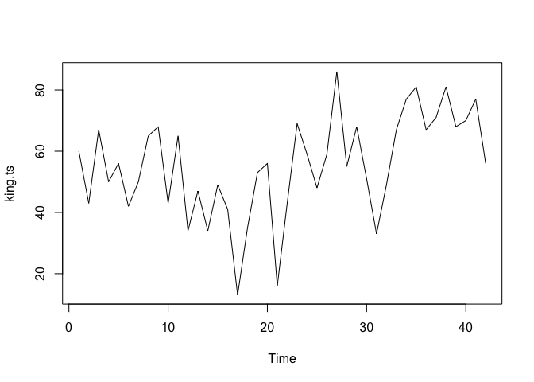<!-- -->
- 나) 3년마다 평균을 내서 그래프를 부드럽게 표현

``` r
king.sma3 <- SMA(king.ts, n = 3)

plot.ts(king.sma3)
```

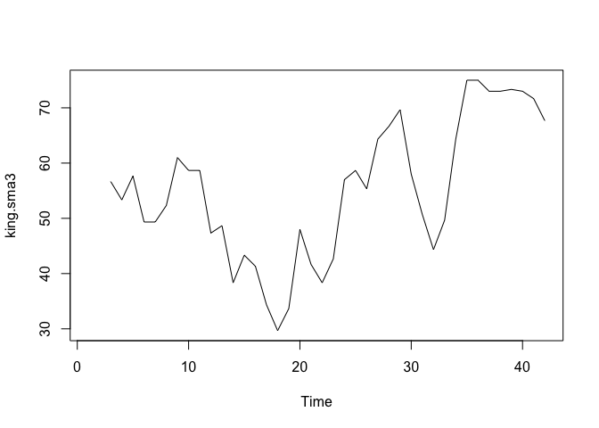<!-- -->

  - 다) 8년마다 평균을 내서 그래프를 부드럽게 표현

<!-- end list -->

``` r
king.sma8 <- SMA(king.ts, n = 8)

plot.ts(king.sma8)
```

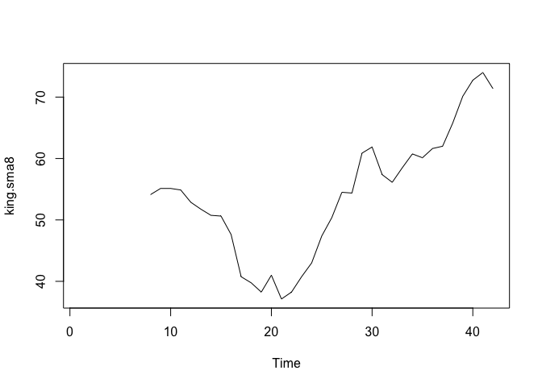<!-- -->

  - **\[2\] ARIMA 모델**
      - 가) 개요
          - ARIMA 모델은 정상성 시계열에 한해 사용한다
          - 비정상 시계열 자료는 차분해 정상성으로 만족하는 조건의 시계열로 바꿔준다
          - 이전 그래프에서 평균이 시간에 따라 일정치 않은 모습을 보이므로 비정상시계열이다. 따라서 차분을 진행한다
          - 1차 차분 결과에서 평균과 분산이 시간에 따라 의존하지 않음을 확인한다
          - ARIMA(p, 1, q) 모델이며 차분을 1번 해야 정상성을 만족한다

<!-- end list -->

``` r
king.ff1 <- diff(king.ts, differences = 1)

plot.ts(king.ff1)
```

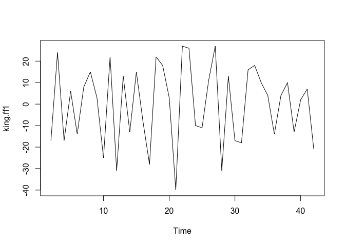<!-- -->

  - 나) ACF와 PACF를 통한 적합한 ARIMA 모델 결정
      - \[\[1\]\] ACF
          - lag는 0 부터 값을 갖는데, 너무 많은 구간을 설정하면 그래프를 보고 판단하기 어렵다
          - ACF 값이 lag 1인 지점 빼고는 모두 점선 구간 안에 있고, 나머지는 구간 안에 있다

<!-- end list -->

``` r
acf(king.ff1, lag.max = 20, plot = FALSE)
```

    ## 
    ## Autocorrelations of series 'king.ff1', by lag
    ## 
    ##      0      1      2      3      4      5      6      7      8      9     10 
    ##  1.000 -0.360 -0.162 -0.050  0.227 -0.042 -0.181  0.095  0.064 -0.116 -0.071 
    ##     11     12     13     14     15     16     17     18     19     20 
    ##  0.206 -0.017 -0.212  0.130  0.114 -0.009 -0.192  0.072  0.113 -0.093

``` r
acf(king.ff1, lag.max = 20)
```

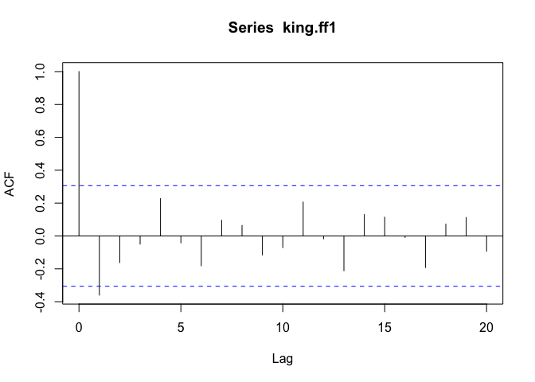<!-- -->
- \[\[2\]\] PACF - PACF 값이 lag 1, 2, 3 에서 점선 구간을 초과하고 음의 값을 가지며 절단점이 lag
4 이다

``` r
pacf(king.ff1, lag.max = 20, plot = FALSE)
```

    ## 
    ## Partial autocorrelations of series 'king.ff1', by lag
    ## 
    ##      1      2      3      4      5      6      7      8      9     10     11 
    ## -0.360 -0.335 -0.321  0.005  0.025 -0.144 -0.022 -0.007 -0.143 -0.167  0.065 
    ##     12     13     14     15     16     17     18     19     20 
    ##  0.034 -0.161  0.036  0.066  0.081 -0.005 -0.027 -0.006 -0.037

``` r
pacf(king.ff1, lag.max = 20)
```

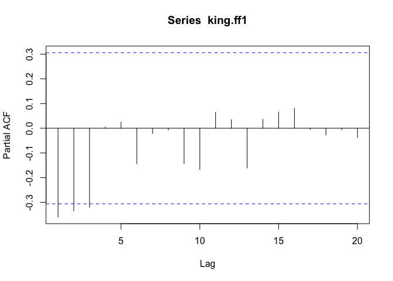<!-- -->

  - 다) 종합
      - ARMA 후보들이 생성
          - \[\[1\]\] ARMA(3, 0) 모델: PACF 값이 lag4에서 절단점을 가짐. AR(3) 모형
          - \[\[2\]\] ARMA(0, 1) 모델: ACF 값이 lag2에서 절단점을 가짐. MA(1) 모형
          - \[\[3\]\] ARMA(p, q) 모델: 그래서 AR 모형과 MA 모형을 혼합
  - 라) 적절한 ARIMA 모형 찾기
      - forecast package 에 내장된 auto.arima() 함수를 이용
      - 영국 왕의 사망 나이 데이터의 적절한 ARIMA 모형은 ARIMA(0, 1, 1) 이다

<!-- end list -->

``` r
auto.arima(king)
```

    ## Series: king 
    ## ARIMA(0,1,1) 
    ## 
    ## Coefficients:
    ##           ma1
    ##       -0.7218
    ## s.e.   0.1208
    ## 
    ## sigma^2 estimated as 236.2:  log likelihood=-170.06
    ## AIC=344.13   AICc=344.44   BIC=347.56

  - 마) 예측
      - 42명의 영국왕 중에서 마지막 왕의 사망시 나이는 56세
      - 43번째 에서 52번째 왕까지 10명의 왕의 사망시 나이를 예측한 결과 67.75살로 추정된다
      - 5명 정도만 예측하고 싶다면, 옵션에 h = 5를 입력한다
      - 신뢰 구간은 80% \~ 95% 사이

<!-- end list -->

``` r
king.arima <- arima(king, order = c(0, 1, 1))
king.forecasts <- forecast(king.arima)
king.forecasts
```

    ##    Point Forecast    Lo 80    Hi 80    Lo 95     Hi 95
    ## 43       67.75063 48.29647 87.20479 37.99806  97.50319
    ## 44       67.75063 47.55748 87.94377 36.86788  98.63338
    ## 45       67.75063 46.84460 88.65665 35.77762  99.72363
    ## 46       67.75063 46.15524 89.34601 34.72333 100.77792
    ## 47       67.75063 45.48722 90.01404 33.70168 101.79958
    ## 48       67.75063 44.83866 90.66260 32.70979 102.79146
    ## 49       67.75063 44.20796 91.29330 31.74523 103.75603
    ## 50       67.75063 43.59372 91.90753 30.80583 104.69543
    ## 51       67.75063 42.99472 92.50653 29.88974 105.61152
    ## 52       67.75063 42.40988 93.09138 28.99529 106.50596

# Chapter 5 - 다차원 척도법

## 1\. 다차원 척도법 (Multi-Dimensional Scaling)

  - 객체간 근접성(proximity)을 시각화 하는 통계기법이다
  - 군집분석과 같이 개체들을 대상으로 변수들을 측정한 후에 개체들 사이의 유사성/비유사성을 측정하여 개체들을 2차원 공간상에
    점으로 표현하는 분석방법이다
  - 개체들을 2차원 또는 3차원 공간상에 점으로 표현하여 개체들 사이의 집단화를 시각적으로 표현하는 분석방법이다

## 2\. 다차원 척도법 목적

  - 데이터 속에 잠재해 있는 패턴(pattern) 구조를 찾아낸다
  - 그 구조를 소수 차원의 공간에 기하학(geometry)적으로 표현한다
  - 데이터 축소(Data Reduction)의 목적으로 다차원척도법을 이용한다. 즉, 데이터에 포함되는 정보를 끄집어내기
    위해서 다차원척도법을 탐색수단으로 사용한다
  - 다차원척도법에 의해서 얻은 결과를, 데이터가 만들어진 현상이나 과정에 고유의 구조로서 의미를 부여한다

## 3\. 다차원 척도법 방법

  - 개체들의 거리 계산에는 **유클리드 거리행렬** 을 활용한다


  - 관측대상들의 상대적 거리의 정확도를 높이기 위해 적합 정도를 스트레스 값(stress value)으로 나타낸다

  - 각 개체들을 공간상에 표현하기 위한 방법은 부적합도 기준으로 STRESS 나 S-STRESS 를 사용한다

  - 최적모형의 적합은 부적합도를 최소로 하는 반복알고리즘을 이용하며, 이 값이 일정 수준 이하가 될 때 최종적으로 적합된
    모형으로 제시한다

  - 스트레스 값은
      
    (d\_{ij} = 관측대상 i 부터 j 까지 실제거리, hat{d\_{ij}}) = 프로그램에 의해 추정된 거리)

  - **STRESS**
    
      - 0
      - **적합도 수준**
          - 완벽(perfect)

  - **STRESS**
    
      - 0.05 이내
      - **적합도 수준**
          - 매우 좋은(excellent)

  - **STRESS**
    
      - 0.05 \~ 0.10
      - **적합도 수준**
          - 만족(satisfactory)

  - **STRESS**
    
      - 0.10 \~ 0.15
      - **적합도 수준**
          - 보통(acceptable, but doubt)

  - **STRESS**
    
      - 0.15 이상
      - **적합도 수준**
          - 나쁨(poor)

## 4\. 다차원 척도법 종류

#### 가. 계량적 MDS (Metric MDS)

  - 데이터가 **구간척도나 비율척도인 경우 활용** 한다
  - (전통적인 다차원척도법) N개의 케이스에 대하서 p개의 특성변수가 있는 경우, 각 개체들간의 유클리드 거리행렬을 계산하고
    개체들간의 비유사성 S(거리제곱 행렬의 선형함수)를 공간상에 표현한다
  - <사례>
      - **cmdscale 사례**
      - MASS package의 eurodist 자료를 이용한다
      - 유럽의 21개 도시들 사이의 거리를 측정한다
      - cmdscale을 이용하여 2차원으로 21개 도시들을 매핑한다
      - 종축은 북쪽 도시를 상단에 표시하기 위해 부호를 바꾼다

<!-- end list -->

``` r
library(MASS)

loc <- cmdscale(eurodist)
head(loc)
```

    ##                 [,1]      [,2]
    ## Athens    2290.27468 1798.8029
    ## Barcelona -825.38279  546.8115
    ## Brussels    59.18334 -367.0814
    ## Calais     -82.84597 -429.9147
    ## Cherbourg -352.49943 -290.9084
    ## Cologne    293.68963 -405.3119

``` r
x <- loc[, 1]
y <- -loc[, 2]

plot(x, y, type = "n", asp = 1, main = "Metric MDS")
text(x, y, rownames(loc), cex = 0.7)
abline(v = 0, h = 0, lty = 2, lwdd = 0.5)
```

    ## Warning in int_abline(a = a, b = b, h = h, v = v, untf = untf, ...): "lwdd" is
    ## not a graphical parameter

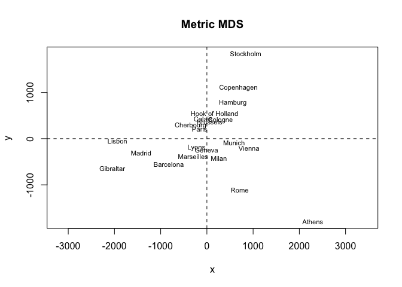<!-- -->

#### 나. 비계량적 MDS (nonmetric MDS)

  - 데이터가 **순서척도** 인 경우 활용한다
  - 개체들 간의 거리가 순서로 주어진 경우에는 순서척도를 거링의 속성과 같도록 변환(monotone
    transformation)하여 거리를 생성한 후 적용한다
  - <사례>
      - **isoMDS 사례**
      - MASS package의 Swiss 자료를 이용하여 2차원으로 도시들을 매핑한다
      - 1888년 경의 스위스 연방 중 47개의 불어권 주의 토양의 비옥도 지수와 여러 사회경제적 지표를 측정한 자료이다

<!-- end list -->

``` r
library(MASS)
data(swiss)
str(swiss)
```

    ## 'data.frame':    47 obs. of  6 variables:
    ##  $ Fertility       : num  80.2 83.1 92.5 85.8 76.9 76.1 83.8 92.4 82.4 82.9 ...
    ##  $ Agriculture     : num  17 45.1 39.7 36.5 43.5 35.3 70.2 67.8 53.3 45.2 ...
    ##  $ Examination     : int  15 6 5 12 17 9 16 14 12 16 ...
    ##  $ Education       : int  12 9 5 7 15 7 7 8 7 13 ...
    ##  $ Catholic        : num  9.96 84.84 93.4 33.77 5.16 ...
    ##  $ Infant.Mortality: num  22.2 22.2 20.2 20.3 20.6 26.6 23.6 24.9 21 24.4 ...

``` r
head(swiss)
```

    ##              Fertility Agriculture Examination Education Catholic
    ## Courtelary        80.2        17.0          15        12     9.96
    ## Delemont          83.1        45.1           6         9    84.84
    ## Franches-Mnt      92.5        39.7           5         5    93.40
    ## Moutier           85.8        36.5          12         7    33.77
    ## Neuveville        76.9        43.5          17        15     5.16
    ## Porrentruy        76.1        35.3           9         7    90.57
    ##              Infant.Mortality
    ## Courtelary               22.2
    ## Delemont                 22.2
    ## Franches-Mnt             20.2
    ## Moutier                  20.3
    ## Neuveville               20.6
    ## Porrentruy               26.6

``` r
swiss.x <- as.matrix(swiss[, -1])
swiss.dist <- dist(swiss.x)
swiss.mds <- isoMDS(swiss.dist)
```

    ## initial  value 2.979731 
    ## iter   5 value 2.431486
    ## iter  10 value 2.343353
    ## final  value 2.338839 
    ## converged

``` r
plot(swiss.mds$points, type = "n")
text(swiss.mds$points, labels = as.character(1:nrow(swiss.x)))
abline(v = 0, h = 0, lty = 2, lwd = 0.5)
```

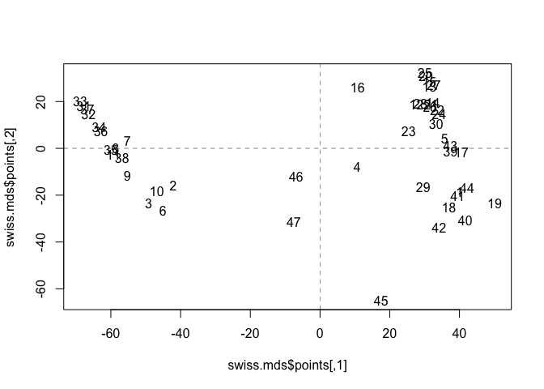<!-- -->

# Chapter 6 - 주성분 분석

## 1\. 주성분 분석(Principal Component Analysis)

  - 여러 변수들의 변량을 “주성분(principal component)” 이라는 **서로 상관성이 높은 변수들의 선형결합**
    으로 만들어 기존의 상관성이 높은 변수들을 요약, 축소하는 기법이다
  - 첫 번째 주성분으로 전체 변동(variation)을 가장 많이 설명할 수 있도록 하고, 두 번째 주성분으로는 첫 번째
    주성분과는 상관이 없어서(낮아서) 첫 번째 주성분이 설명하지 못하는 나머지 변동을 정보의 손실 없이 가장 많이
    설명할 수 있도록 변수들의 선형조합을 만든다

## 2\. 주성분 분석의 목적

  - 여러 변수들 간에 내재하는 상관관계, 연관성을 이횽해 **소수의 주성분으로 차원을 축소** 함으로써 데이터를 이해하기 쉽고
    관리하기 쉽게 해준다
  - 다중공선성(multicollinearity)이 존재하는 경우, **상관성이 없는(적은) 주성분으로 변수들을 축소** 하여
    모형 개발에 활용된다. **(회귀분석이나 의사결정나무(decision tree))** 등의 모형 개발 시 입력변수들간의
    상관관계가 높은 **다중공선성(multicollinearity)** 이 존재할 경우 모형이 잘못 만들어져 문제가 생김)
  - 연관성이 높은 변수를 주성분분석을 통해 차원을 축소한 후에 **군집분석을 수행하면 군집화 결과와 연산속도를 개선** 할 수
    있다
  - 기계에서 나오는 다수의 센서데이터를 주성분분석으로 차원을 축소한 후에 시계열로 분포나 추세의 변화를 분석하면 기계의
    고장(fata failure) 징후를 사전에 파악하는데 활용하기도 한다

## 3\. 주성분분석 vs 요인분석

#### 가. 요인분석(Factor Analysis)

  - 등간척도(혹은 비율척도)로 측정한 두 개 이상의 변수들에 잠재되어 있는 공통인자를 찾아내는 기법이다

#### 나. 공통점

  - 모두 데이터를 축소하는데 활용된다
  - 원래 데이터를 활용해서 몇 개의 새로운 변수들을 만들수 있다

#### 다. 차이점

  - **\[1\] 생성된 변수의 수**
      - 요인분석은 몇 개라고 지정 없이(2 or 3, 4, 5 …) 만들 수 있다
      - 주성분분석은 제1주성분, 제2주성분, 제3주성분 정도로 활용한다. (대개 4개 이상은 넘지 않음)
  - **\[2\] 생성된 변수의 이름**
      - **요인분석** 은 분석자가 **요인의 이름을 명명** 한다
      - **주성분분석** 은 주로 **제1주성분, 제2주성분** 등으로 표현된다
  - **\[3\] 생성된 변수들 간의 관계**
      - 요인분석의 새 변수들은 기본적으로 대등한 관계를 갖고 “어떤 것이 더 중요하다” 라는 의미는 없다. 단,
        분류/예측에 그 다음 단계로 사용 된다면 그 때 중요성의 의미가 부여된다
      - 주성분분석은 제1주성분이 가장 중요하고, 그 다음 제2주성분이 중요하게 취급된다
  - **\[4\] 분석 방법의 의미**
      - 요인분석은 목표변수를 고려하지 않고 그냥 데이터가 주어지면 변수들을 비슷한 성격들로 묶에서 새로운
        \[잠재\]변수들을 만든다
      - 주성분분석은 목표 변수를 고려하여 목표 변수를 잘 예측/분류하기 위하여 원래 변수들의 선형 결합으로 이루어진 몇
        개의 주성분(변수)들을 찾아내게 된다

## 4\. 주성분의 선택법

  - 주성분분석의 결과에서 **누적기여율(cumulative proprtion)** 이 85% 이상이면 주성분의 수로 결정할 수
    있다
  - **Scree plot** 을 활용하여 고유값(eigen value)이 수평을 유지하기 전단계로 주성분의 수를 선택한다

## 5\. 주성분 분석 사례

#### 가. USArrests 자료

  - 1973년 미국 50개 주의 100,000명의 인구 당 체포된 세 가지 강력범죄수(assault, murder,
    rape)와 각 주마다 도시에 거주하는 인구의 비율(%)로 구성되어 있다

  - 변수들 간의 척도의 차이가 상당히 크기 떄문에 상관행렬을 사용하여 분석한다

  - 특이치 분해를 사용하는 경우 자료 행렬의 각 변수의 평균과 제곱의 합이 1로 표준화되었다고 가정할 수 있다

  - **\[1\] 4개의 변수들 간의 산점도**

<!-- end list -->

``` r
library(datasets)
data(USArrests)

str(USArrests)
```

    ## 'data.frame':    50 obs. of  4 variables:
    ##  $ Murder  : num  13.2 10 8.1 8.8 9 7.9 3.3 5.9 15.4 17.4 ...
    ##  $ Assault : int  236 263 294 190 276 204 110 238 335 211 ...
    ##  $ UrbanPop: int  58 48 80 50 91 78 77 72 80 60 ...
    ##  $ Rape    : num  21.2 44.5 31 19.5 40.6 38.7 11.1 15.8 31.9 25.8 ...

``` r
pairs(USArrests, panel = panel.smooth, main = "USArrests data")
```

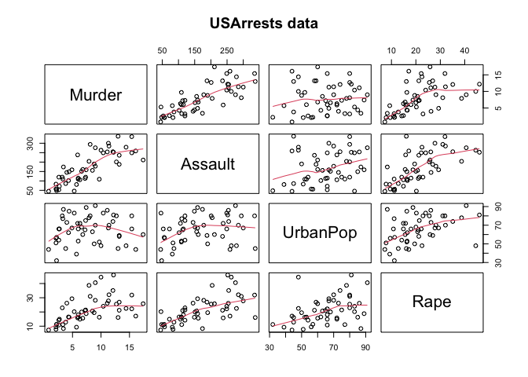<!-- -->

  - **\[2\] summary**
      - 제1주성분과 제2주성분까지의 누적 분산비율은 대략 86.8%로 2개의 주성분 변수를 활용하여 전체 데이터의
        86.8%를 설명할 수 있다
      - 주성분들에 의해 설명되는 변동의 비율은 Screeplot을 통해 확인 가능하다

<!-- end list -->

``` r
US.prin <- princomp(USArrests, cor = TRUE)
US.prin
```

    ## Call:
    ## princomp(x = USArrests, cor = TRUE)
    ## 
    ## Standard deviations:
    ##    Comp.1    Comp.2    Comp.3    Comp.4 
    ## 1.5748783 0.9948694 0.5971291 0.4164494 
    ## 
    ##  4  variables and  50 observations.

``` r
summary(US.prin)
```

    ## Importance of components:
    ##                           Comp.1    Comp.2    Comp.3     Comp.4
    ## Standard deviation     1.5748783 0.9948694 0.5971291 0.41644938
    ## Proportion of Variance 0.6200604 0.2474413 0.0891408 0.04335752
    ## Cumulative Proportion  0.6200604 0.8675017 0.9566425 1.00000000

``` r
screeplot(US.prin, npcs = 4, type = "lines")
```

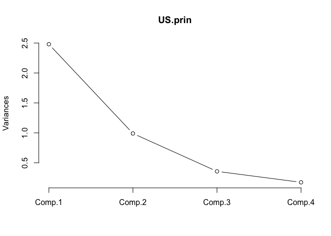<!-- -->

  - **\[3\] Loading**
      - 네 개의 변수가 각 주성분 Comp.1 - Comp.4 까지 기여하는 가중치가 제시된다
      - 제1주성분에는 네 개의 변수가 평균적으로 기여한다
      - 제2주성분에서는 (Murder, Assault)와 (UrbanPop, Rape)의 계수의 부호가 서로 다르다

<!-- end list -->

``` r
loadings(US.prin)
```

    ## 
    ## Loadings:
    ##          Comp.1 Comp.2 Comp.3 Comp.4
    ## Murder    0.536  0.418  0.341  0.649
    ## Assault   0.583  0.188  0.268 -0.743
    ## UrbanPop  0.278 -0.873  0.378  0.134
    ## Rape      0.543 -0.167 -0.818       
    ## 
    ##                Comp.1 Comp.2 Comp.3 Comp.4
    ## SS loadings      1.00   1.00   1.00   1.00
    ## Proportion Var   0.25   0.25   0.25   0.25
    ## Cumulative Var   0.25   0.50   0.75   1.00

  - **\[4\] Scores**
      - 각 주성분 Comp.1 - Comp. 4 의 선형ㅇ식을 통해 각 지역(record) 별로 얻은 결과를 계산한다

<!-- end list -->

``` r
US.prin$scores
```

    ##                     Comp.1      Comp.2      Comp.3       Comp.4
    ## Alabama         0.98556588  1.13339238  0.44426879  0.156267145
    ## Alaska          1.95013775  1.07321326 -2.04000333 -0.438583440
    ## Arizona         1.76316354 -0.74595678 -0.05478082 -0.834652924
    ## Arkansas       -0.14142029  1.11979678 -0.11457369 -0.182810896
    ## California      2.52398013 -1.54293399 -0.59855680 -0.341996478
    ## Colorado        1.51456286 -0.98755509 -1.09500699  0.001464887
    ## Connecticut    -1.35864746 -1.08892789  0.64325757 -0.118469414
    ## Delaware        0.04770931 -0.32535892  0.71863294 -0.881977637
    ## Florida         3.01304227  0.03922851  0.57682949 -0.096284752
    ## Georgia         1.63928304  1.27894240  0.34246008  1.076796812
    ## Hawaii         -0.91265715 -1.57046001 -0.05078189  0.902806864
    ## Idaho          -1.63979985  0.21097292 -0.25980134 -0.499104101
    ## Illinois        1.37891072 -0.68184119  0.67749564 -0.122021292
    ## Indiana        -0.50546136 -0.15156254 -0.22805484  0.424665700
    ## Iowa           -2.25364607 -0.10405407 -0.16456432  0.017555916
    ## Kansas         -0.79688112 -0.27016470 -0.02555331  0.206496428
    ## Kentucky       -0.75085907  0.95844029  0.02836942  0.670556671
    ## Louisiana       1.56481798  0.87105466  0.78348036  0.454728038
    ## Maine          -2.39682949  0.37639158  0.06568239 -0.330459817
    ## Maryland        1.76336939  0.42765519  0.15725013 -0.559069521
    ## Massachusetts  -0.48616629 -1.47449650  0.60949748 -0.179598963
    ## Michigan        2.10844115 -0.15539682 -0.38486858  0.102372019
    ## Minnesota      -1.69268181 -0.63226125 -0.15307043  0.067316885
    ## Mississippi     0.99649446  2.39379599  0.74080840  0.215508013
    ## Missouri        0.69678733 -0.26335479 -0.37744383  0.225824461
    ## Montana        -1.18545191  0.53687437 -0.24688932  0.123742227
    ## Nebraska       -1.26563654 -0.19395373 -0.17557391  0.015892888
    ## Nevada          2.87439454 -0.77560020 -1.16338049  0.314515476
    ## New Hampshire  -2.38391541 -0.01808229 -0.03685539 -0.033137338
    ## New Jersey      0.18156611 -1.44950571  0.76445355  0.243382700
    ## New Mexico      1.98002375  0.14284878 -0.18369218 -0.339533597
    ## New York        1.68257738 -0.82318414  0.64307509 -0.013484369
    ## North Carolina  1.12337861  2.22800338  0.86357179 -0.954381667
    ## North Dakota   -2.99222562  0.59911882 -0.30127728 -0.253987327
    ## Ohio           -0.22596542 -0.74223824  0.03113912  0.473915911
    ## Oklahoma       -0.31178286 -0.28785421  0.01530979  0.010332321
    ## Oregon          0.05912208 -0.54141145 -0.93983298 -0.237780688
    ## Pennsylvania   -0.88841582 -0.57110035  0.40062871  0.359061124
    ## Rhode Island   -0.86377206 -1.49197842  1.36994570 -0.613569430
    ## South Carolina  1.32072380  1.93340466  0.30053779 -0.131466685
    ## South Dakota   -1.98777484  0.82334324 -0.38929333 -0.109571764
    ## Tennessee       0.99974168  0.86025130 -0.18808295  0.652864291
    ## Texas           1.35513821 -0.41248082  0.49206886  0.643195491
    ## Utah           -0.55056526 -1.47150461 -0.29372804 -0.082314047
    ## Vermont        -2.80141174  1.40228806 -0.84126309 -0.144889914
    ## Virginia       -0.09633491  0.19973529 -0.01171254  0.211370813
    ## Washington     -0.21690338 -0.97012418 -0.62487094 -0.220847793
    ## West Virginia  -2.10858541  1.42484670 -0.10477467  0.131908831
    ## Wisconsin      -2.07971417 -0.61126862  0.13886500  0.184103743
    ## Wyoming        -0.62942666  0.32101297  0.24065923 -0.166651801

  - **\[5\] 제 1-2 주성분에 의한 행렬도**
      - 조지아, 메릴랜드, 뉴 멕시코 등은 폭행과 살인의 비율이 상대적으로 높은 지역이다
      - 미시간, 텍사스 등은 강간의 비율이 높은 지역이다
      - 콜로라도, 캘리포니아, 뉴저지 등은 도시에 거주하는 인구의 비율이 높은 지역이다
      - 아이다호, 뉴 햄프셔, 아이오와 등의 도시들은 도시에 거주하는 인구의 비율이 상대적으로 낮으면서 3대 강력범죄도
        낮다

<!-- end list -->

``` r
arrests.pca <- prcomp(USArrests, center = TRUE, scale. = TRUE)
biplot(arrests.pca, scale = 0)
```

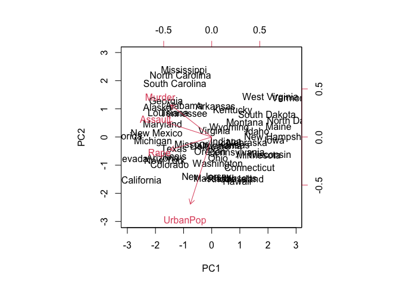<!-- -->
